<div align="center">

# ⚔️ JDR Mapping

**L'atelier du maître du jeu : carte du monde, cartes de combat en 2D semi-3D, fiches de personnages
et suivi des combats en direct.**

<a href="docs/visite-guidee.mp4">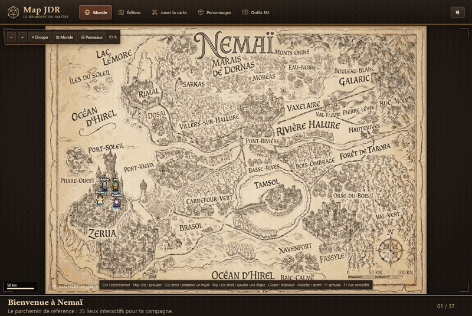</a>

**🎬 [Regarder la visite guidée en vidéo (MP4, 2 min)](docs/visite-guidee.mp4)** · 34 scènes : thème Grimoire, équipement, atlas, camp, carnet, rencontres préparées et attaques des 15 nouveaux monstres

Génère le monde de ta campagne, suis le groupe de ville en donjon, construis les cartes de combat,
puis fais jouer l'affrontement : initiative, points de vie, sorts, jets de dés, brouillard de guerre,
écran pour les joueurs, animations, sons, expérience et montée de niveau.
Et quand tu veux : **règles strictes**, **IA pour les héros et les monstres**, et **simulateur** qui joue
une rencontre 200 fois pour en mesurer la difficulté réelle. Le MJ garde toujours la main.

*Aucune installation, aucun compte, aucun serveur : ouvre `index.html` dans ton navigateur.*

**Habillage Grimoire** : panneaux en cuir sombre, fiches et outils du MJ sur parchemin, accents rouge et or,
icônes dessinées et cartes posées sur une table de jeu. Les textures et polices fonctionnent hors ligne.
Les nouveaux mondes utilisent le style parchemin, désactivable dans les options d'affichage.

**Équipement des aventuriers** : 55 équipements, objets personnalisés, inventaire visuel, effets réels en combat et coffre commun.
**Atlas de campagne** : mini-carte, favoris, lieux visités et itinéraires à étapes avec estimation des vivres.
**Camp des aventuriers** : état du groupe, répartition des provisions, allures de voyage et repos avec choix des dés de vie.
**Carnet du MJ** : séances, PNJ, quêtes à objectifs et bibliothèque de rencontres avec renforts.

</div>

---

## ✨ Aperçu

<table>
<tr>
<td width="33%" align="center"><a href="#-le-monde">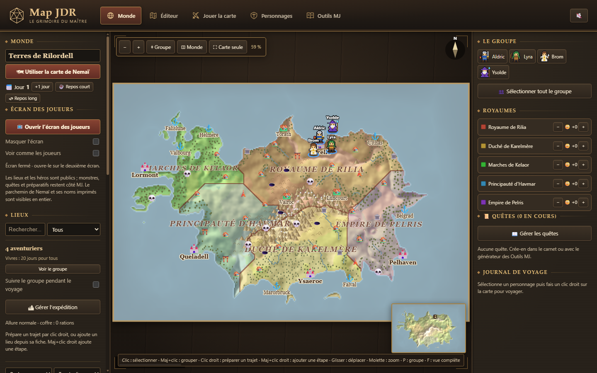</a><br><b>Carte du monde</b><br><sub>royaumes, villes, donjons, voyages</sub></td>
<td width="33%" align="center"><a href="#-léditeur-de-carte">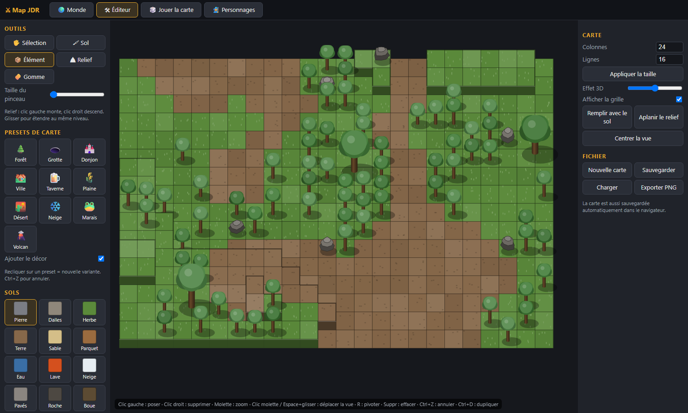</a><br><b>Éditeur de carte</b><br><sub>sols, éléments, relief, 10 presets</sub></td>
<td width="33%" align="center"><a href="#-les-personnages">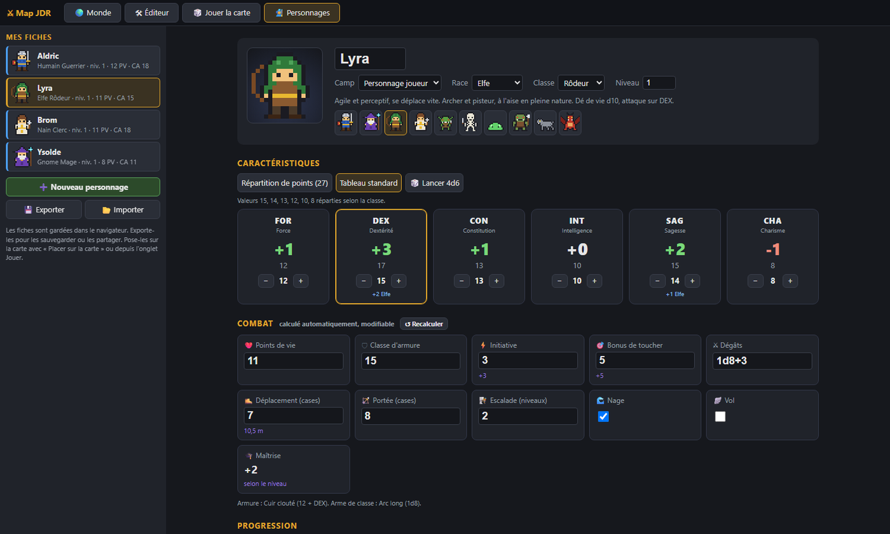</a><br><b>Fiches de personnages</b><br><sub>races, classes, caractéristiques</sub></td>
</tr>
<tr>
<td align="center"><a href="#-portées-de-déplacement-et-dattaque">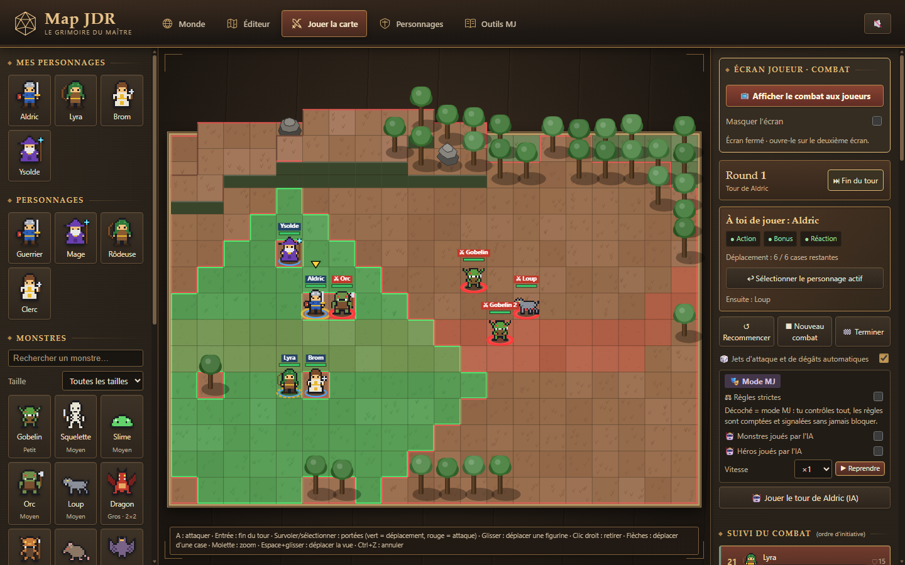</a><br><b>Portées</b><br><sub>déplacement et attaque selon le relief</sub></td>
<td align="center"><a href="#-capacités-et-sorts">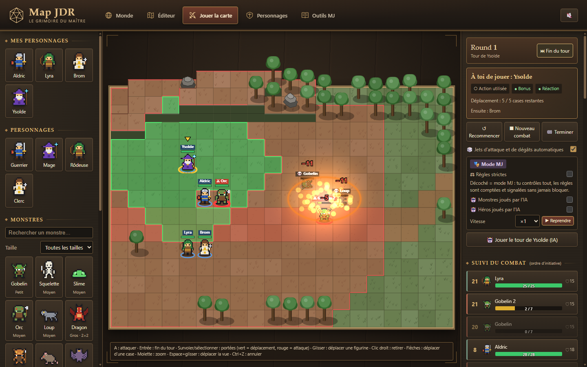</a><br><b>Capacités et sorts</b><br><sub>boule de feu, soins, bénédiction...</sub></td>
<td align="center"><a href="#-attaques-animées">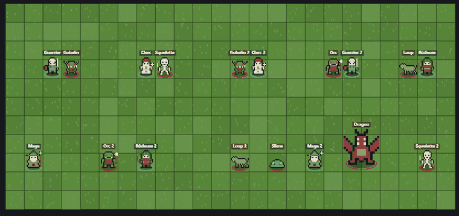</a><br><b>Attaques animées</b><br><sub>une animation par figurine</sub></td>
</tr>
<tr>
<td align="center"><a href="#-écran-des-joueurs-et-brouillard-de-guerre">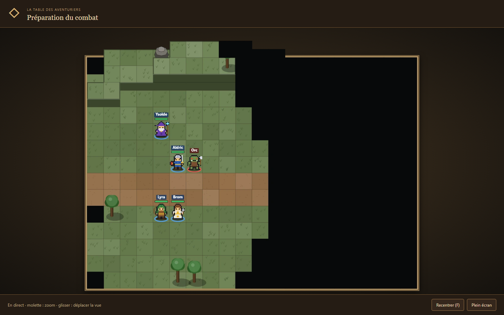</a><br><b>Écran des joueurs</b><br><sub>brouillard de guerre, figurines cachées</sub></td>
<td align="center"><a href="#-onglet-outils-mj">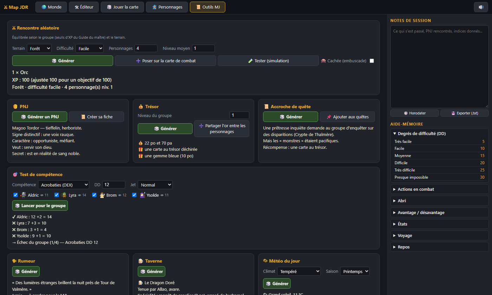</a><br><b>Outils du MJ</b><br><sub>rencontres, PNJ, trésors, quêtes...</sub></td>
<td align="center"><a href="#-simulateur-de-combat">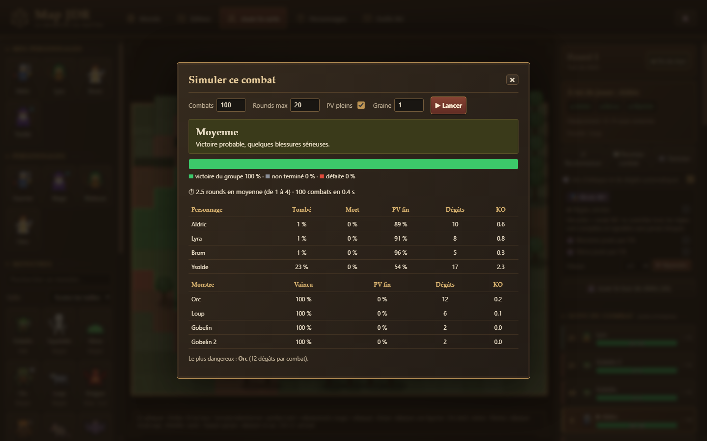</a><br><b>Simulateur de combat</b><br><sub>200 combats joués par l'IA en une seconde</sub></td>
</tr>
</table>

---

## 📚 Sommaire

1. [Démarrage rapide](#-démarrage-rapide)
2. [Ta première partie, pas à pas](#-ta-première-partie-pas-à-pas)
3. [Les onglets](#-les-onglets)
4. [🌍 Le monde](#-le-monde)
5. [🛠 L'éditeur de carte](#-léditeur-de-carte)
6. [🧙 Les personnages](#-les-personnages)
7. [🎲 Jouer un combat](#-jouer-un-combat)
   - [Placer les figurines](#placer-les-figurines) · [Portées](#-portées-de-déplacement-et-dattaque) · [Déroulement](#déroulement-dun-combat)
   - [Attaques](#-attaques-animées) · [Capacités et sorts](#-capacités-et-sorts) · [États](#-états) · [Jets contre la mort](#-jets-contre-la-mort)
   - [Mode MJ ou règles strictes](#-mode-mj-ou-règles-strictes) · [Actions du tour](#-actions-du-tour) · [Statistiques complètes](#-statistiques-complètes)
   - [Intelligence artificielle](#-intelligence-artificielle) · [Panneau de suivi](#-le-panneau-de-suivi) · [Fin du combat](#-fin-du-combat-et-expérience)
8. [🧪 Simulateur de combat](#-simulateur-de-combat)
9. [🎭 Outils du MJ](#-outils-du-mj)
10. [🔊 Sons](#-sons)
11. [📄 Le fichier de caractéristiques](#-le-fichier-de-caractéristiques)
12. [💾 Sauvegardes et fichiers](#-sauvegardes-et-fichiers)
13. [⌨️ Raccourcis](#️-raccourcis)
14. [❓ Questions fréquentes](#-questions-fréquentes)
15. [🧩 Pour aller plus loin (code)](#-pour-aller-plus-loin-code)

---

## 🚀 Démarrage rapide

1. Télécharge le dépôt (bouton **Code → Download ZIP** sur GitHub) ou clone-le :

   ```bash
   git clone https://github.com/PhD-90/JDR_MAPPING.git
   ```

2. Ouvre **`index.html`** dans Chrome, Edge ou Firefox (double-clic).
3. C'est tout. Tout est enregistré automatiquement dans le navigateur.

> 💡 Pour profiter de tout (lecture automatique du fichier de caractéristiques, écran des joueurs le plus fiable),
> tu peux aussi servir le dossier avec un petit serveur local, par exemple l'extension VS Code **Live Server**
> ou `python -m http.server` dans le dossier, puis ouvrir `http://localhost:8000`.

---

## 🧭 Ta première partie, pas à pas

| | Étape | Où |
| --- | --- | --- |
| 1 | Crée les héros : nom, race, classe, caractéristiques. Quatre héros d'exemple sont déjà prêts. | 🧙 Personnages |
| 2 | Ouvre la carte du monde : le groupe attend dans une capitale. | 🌍 Monde |
| 3 | Sélectionne le groupe (**⌖ Groupe**) puis fais un **clic droit** sur un donjon : vérifie le trajet et clique **Partir vers la prochaine étape**. | 🌍 Monde |
| 4 | Clique sur le donjon puis **⚔ Générer la carte de combat** : une carte adaptée au lieu est créée et ouverte dans l'éditeur. | 🌍 Monde → 🛠 Éditeur |
| 5 | Ajuste la carte si besoin : murs, relief, pièges... | 🛠 Éditeur |
| 6 | Pose les héros (**Mes personnages**) et les monstres, ou génère une **rencontre équilibrée** et clique **➕ Poser sur la carte de combat**. | 🎲 Jouer / 📜 Outils MJ |
| 7 | Active le **🌫 brouillard de guerre** et ouvre l'**📺 écran des joueurs** sur la télé. | 🎲 Jouer |
| 8 | **⚔ Commencer le combat** : l'initiative est lancée, chacun joue à son tour (déplacement, **⚔ Attaquer**, sorts). | 🎲 Jouer |
| 9 | Joue les monstres toi-même, ou confie-les à l'IA (**🤖**). Avant la partie, **🧪 simule** la rencontre pour vérifier sa difficulté. | 🎲 Jouer |
| 10 | **🏁 Terminer** : l'XP est partagée, les PV sont enregistrés sur les fiches, et on peut monter de niveau. | 🎲 Jouer → 🧙 Personnages |

---

## 🗂 Les onglets

| Onglet | Rôle |
| --- | --- |
| 🌍 **Monde** | Carte du monde générée, lieux, position des personnages, voyages, calendrier, sauvegarde de campagne |
| 🛠 **Éditeur** | Construire la carte de combat : sols, éléments, relief, presets |
| 🎲 **Jouer la carte** | Le combat : figurines, initiative, PV, attaques, sorts, brouillard, écran des joueurs |
| 🧙 **Personnages** | Fiches de personnages et de PNJ, progression |
| 📜 **Outils MJ** | Générateurs, carnet de campagne (séances, PNJ, quêtes, rencontres préparées), notes et aide-mémoire |

En haut à droite : **🔊** pour couper ou activer le son, et **📍 nom du lieu** quand la carte de combat ouverte
appartient à un lieu du monde (un clic y ramène).

---

## 🌍 Le monde


### Génération

Le monde est créé à partir d'une **graine** : la même graine redonne toujours le même monde. Trois formes au choix :
**Continent**, **Archipel**, **Grand continent**.

1. **Relief** : bruit fractal (fBm) et crêtes pour dessiner des chaînes de montagnes ; océan sur les bords.
2. **Mer et lacs** : le niveau de la mer est réglé pour obtenir la part de terres voulue ; les cuvettes forment des lacs.
3. **Rivières** : elles descendent selon la plus forte pente depuis les hauteurs jusqu'à la mer.
4. **Climat** : humidité (distance à l'eau) et température (latitude et altitude).
5. **Biomes** : 19 terrains (prairie, forêt, jungle, désert, savane, steppe, taïga, toundra, marais, collines,
   montagnes, sommets, neiges éternelles, côtes...).
6. **Royaumes** : chaque terre est rattachée à la capitale la plus proche ; montagnes et grands fleuves font frontière.
7. **Lieux** nommés et décrits : 🏰 capitales, 🏘️ villes et ⚓ ports (sur les côtes et les rivières), 🏠 villages,
   💀 donjons, 🏛️ ruines, 🕳️ grottes, 🗼 tours, ⛩️ temples.

La méthode s'inspire de [Red Blob Games](https://www.redblobgames.com/maps/polygon-map-generation/) et de
[Azgaar's Fantasy Map Generator](https://github.com/Azgaar/Fantasy-Map-Generator/wiki/Quick-Start-Tutorial).

### Utilisation

| Action | Comment |
| --- | --- |
| Se déplacer sur la carte | Glisser, molette pour zoomer, **Voir tout le monde** |
| Sélectionner un personnage | Clic sur sa figurine ; **Maj+clic** pour former un groupe |
| Voyager | **Clic droit** prépare le trajet ; **Maj+clic droit** ajoute une étape. Cliquer **Partir vers la prochaine étape** dans le carnet de route. Durée selon le terrain, bateau pour traverser la mer |
| Préparer un trajet | Survoler la carte avec un personnage sélectionné : l'infobulle donne la distance et le nombre de jours |
| Déplacer librement | Glisser une figurine ou un lieu |
| Inspecter un lieu | Clic : nom, type, royaume, terrain, population, description et **notes du MJ** modifiables, personnages présents |
| Créer un lieu | Choisir un type puis **📍 Ajouter** et cliquer sur la carte |
| Faire passer le temps | **+1 jour**, **🛏 Repos long** (le groupe récupère tous ses PV) ; le jour avance aussi avec les voyages |
| Affichage | Royaumes, rivières, montagnes et forêts, noms, **style parchemin** |

Chaque trajet est noté dans le **journal de voyage** (jour, départ, arrivée, distance, terrain traversé).

### Atlas et carnet de route

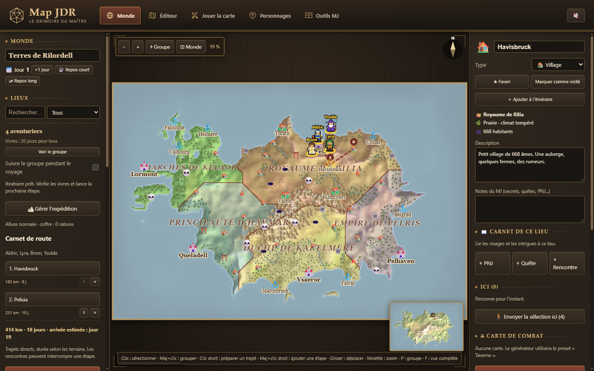

- **Mini-carte** cliquable pour recentrer la vue ; ses flèches clavier déplacent la caméra quand elle a le focus.
- Boutons **+ / −**, **Groupe (P)** et **Monde (F)** ; option pour suivre les aventuriers pendant leur voyage.
- Lieux marqués **favoris** ou **visités**, filtres dédiés, recherche et tri par nom, type ou proximité du groupe.
- Un **itinéraire de 12 étapes maximum**, réordonnable et sauvegardé dans la campagne. Le carnet affiche les kilomètres,
  les jours réellement décomptés, l’arrivée estimée et les rations manquantes par personnage.
- Les trajets suivent des segments directs ; une traversée maritime est signalée pour prévoir un bateau avec le MJ.
- Une rencontre interrompt le déplacement et conserve l’étape à terminer. Résous ou évite la rencontre, puis reprends le trajet.
- Les figurines proches sont espacées à l’écran, sans modifier leurs coordonnées de campagne.

### Camp et préparation de l’expédition

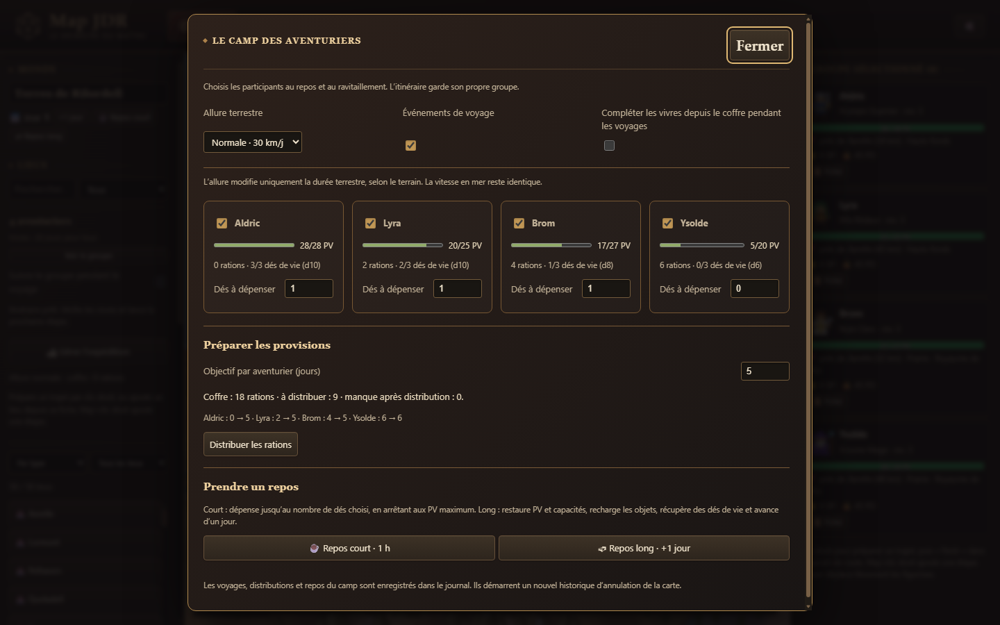

Dans **Monde → Gérer l’expédition**, retrouve les PV, les rations et les dés de vie de chaque aventurier vivant.
Le camp reprend le groupe de l’itinéraire ou la sélection du monde ; coche les participants pour le repos ou le ravitaillement.

- **Provisions** : choisis un objectif de 1 à 365 jours par personne. L’aperçu montre les quantités avant/après et les
  rations encore manquantes. La distribution utilise seulement le coffre commun, en donnant la priorité aux sacs les moins fournis.
- **Allure** : prudente (20 km/j), normale (30 km/j) ou rapide (40 km/j), ajustée selon les terrains.
  Ce réglage agit sur la durée terrestre ; la vitesse en mer reste à 120 km/j. Aucun bonus de discrétion ou malus de perception n’est appliqué.
- **Options de voyage** : événements aléatoires activables et ravitaillement automatique depuis le coffre.
  Seuls les jours effectivement parcourus avant une éventuelle rencontre consomment des vivres.
- **Repos court** : choisis le nombre maximal de dés à dépenser pour chacun, y compris zéro ; les jets s’arrêtent aux PV maximum.
  Le repos recharge aussi les capacités concernées. **Repos long** : PV pleins, capacités, charges des objets et récupération
  de dés de vie pour les participants ; le calendrier avance d’un jour.
- Les figurines déjà placées reçoivent les PV et ressources mis à jour. Les défunts sont exclus ; les voyages, distributions
  et repos du camp attendent la fin d’un combat ou la résolution d’une rencontre en chemin.
- Les opérations sont consignées au journal et sauvegardées. Elles démarrent un nouvel historique d’annulation de la carte,
  afin qu’un ancien geste ne puisse pas rendre des vivres consommés ou annuler des soins sans changer le calendrier.

Les boutons **Repos court / long** du monde ouvrent ce panneau avant application. Le repos individuel de la fiche reste
disponible hors combat et peut s’annuler avec Ctrl+Z. Un voyage sauvegarde immédiatement sa destination finale ;
recharger la page pendant l’animation conserve la position d’arrivée et les ressources déjà décomptées.

### Voyages, quêtes et réputation

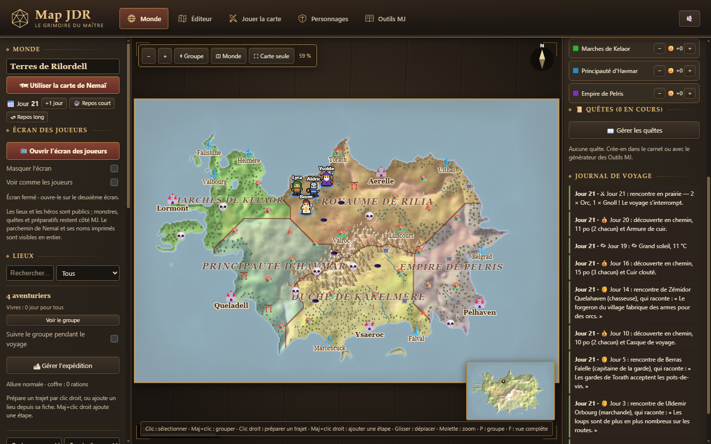

- **Événements de voyage** : chaque jour de route, une chance sur cinq d'un événement selon le terrain :
  ⚔ **rencontre** (équilibrée pour le groupe, elle **arrête le voyage** sur place), 💰 découverte, 🧑 voyageur qui raconte
  une rumeur, 🌦 météo. Une rencontre propose **⚔ Préparer le combat** (carte générée selon le terrain, groupe et
  monstres déjà placés), **🧪 Simuler** ou **✖ Éviter**.
- **Vivres** : chaque aventurier vivant mange une 🍞 ration par jour de route ; sans vivres, il perd 2 PV par jour manquant,
  avec un minimum de 1 PV s’il était conscient. Un personnage déjà à 0 PV reste à 0.
- **📜 Quêtes** : créées dans le **Carnet de campagne** ou depuis le générateur des Outils MJ, avec un **❗** sur le lieu
  visé. Objectifs à cocher, commanditaire, échéance et récompenses personnalisées. **✔ Réussie** distribue l'or et l'XP
  une seule fois et améliore la réputation ; **✖ Échouée** la fait baisser. Le carnet permet d'archiver les quêtes.
- **📖 Carnet de chaque lieu** : ses PNJ et ses quêtes s'ouvrent directement depuis son panneau. Les boutons **+ PNJ**
  et **+ Quête** créent une entrée déjà liée au lieu.
- **Réputation** par royaume (de −5 à +5, réglable avec − / +) : chaque point fait varier les prix de 5 %.
- **🛒 Marché** dans les villes, ports et capitales (choix réduit au village) : potions, antidote, parchemin, rations,
  torches, corde, payés avec l'or de la fiche.
- **☕ Repos court** (dés de vie, capacités de repos court) et **🛏 Repos long** (PV, capacités, dés de vie, +1 jour).

<div align="center">

| Lieu sélectionné, groupe arrivé | Style parchemin |
| --- | --- |
| 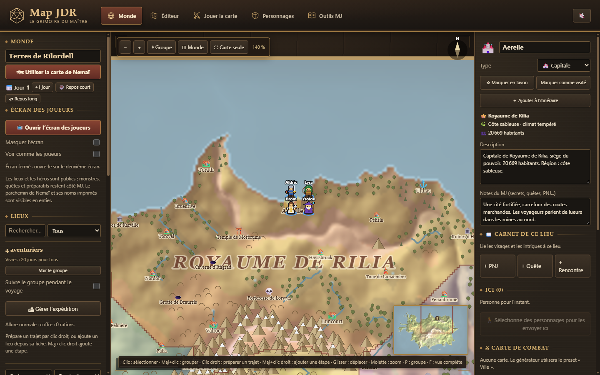 |  |

</div>

### Cartes de combat liées aux lieux

Chaque lieu peut avoir **sa propre carte de combat** :

- **⚔ Générer la carte de combat** : le preset est choisi selon le lieu et le terrain (donjon, ruines et tours → donjon,
  grotte → grotte, ville → ville, village → taverne, forêt → forêt, désert, neige, marais...) ;
- **✏ Éditer** / **🎲 Jouer** pour l'ouvrir ; toutes les modifications sont enregistrées dans le lieu ;
- **📌 Lier la carte de combat actuelle** pour rattacher une carte faite à la main ; **⟳ Regénérer**, **✖ Délier**.

Sur la carte du monde, un **⚔** à côté d'un lieu indique qu'il a une carte de combat.

---

## 🛠 L'éditeur de carte


| Outil | Utilisation |
| --- | --- |
| 🖐 **Sélection** | Déplacer un élément, le redimensionner (poignée orange), le pivoter (**R**), le dupliquer (**Ctrl+D**) |
| 🖌 **Sol** | Peindre avec un pinceau carré ou rond (1 à 10 cases), avec des traits continus |
| 🪣 **Remplir** | Remplacer une zone de même sol reliée par les côtés ; les décors ne bloquent pas le remplissage |
| ▭ **Rectangle** | Glisser entre deux coins, voir les dimensions, puis relâcher pour peindre ; **Échap** annule l'aperçu |
| 📦 **Élément** | Poser un élément ; les murs se tracent en glissant |
| ⛰ **Relief** | Clic gauche monte, clic droit descend, glisser étend au même niveau |
| 🧽 **Gomme** | Effacer des éléments (clic droit efface aussi avec les autres outils) |

- **14 sols** : pierre, dalles, herbe, terre, sable, parquet, eau, lave, neige, pavés, roche, boue, glace, vide.
- **Éléments** : mur, maison, caisse, rocher, arbre, colonne, tonneau, table, coffre, escalier, et des pions simples.
  Chacun a une largeur, une profondeur, une **hauteur**, une couleur et un nom réglables.
  Recherche par nom (avec ou sans accents) et filtres Construction, Nature, Mobilier et Pions.
- **Historique** : boutons Annuler / Rétablir ; un trait de pinceau, un mur ou un geste d'effacement s'annule en une fois.
- **Carte** : nombre de colonnes et de lignes, **Effet 3D** (force du relief), grille, remplir, aplanir.
- **Fichier** : nouvelle carte, sauvegarder / charger en `.json`, **exporter en PNG**.

### Modules de création

Les boutons **Salle**, **Chemin**, **Rivière** et **Dispersion** se trouvent à gauche de l'éditeur.
Choisis un module, règle ses options à droite, puis glisse sur la carte. L'aperçu est appliqué au relâchement ;
**Échap** ou clic droit l'annule. **Ctrl+Z** annule toute la création et **Ctrl+Maj+Z** la rétablit.

| Module | Création et réglages |
| --- | --- |
| 🏰 **Salle** | Rectangle d'au moins 4 × 4 cases avec sol, murs et ouverture au nord, sud, est ou ouest. Sol, hauteur des murs et largeur de l'entrée réglables. La zone doit être libre de décors et de figurines ; l'option Aplanir utilise le niveau du premier coin. |
| 〰 **Chemin** | Tracé libre et continu, avec un revêtement au choix et une largeur de 1 à 6 cases. |
| 🌊 **Rivière** | Tracé d'eau de 1 à 6 cases de large, avec berges de sable facultatives. Les rivières existantes restent en eau au niveau des berges. |
| 🌲 **Dispersion** | Répartit une forêt, des rochers ou des caisses et tonneaux dans un rectangle. Densité réglable ; évite l'eau, la lave, le vide et les cases occupées. Limite de 250 éléments par geste. |

Les chemins et rivières conservent le relief et les décors. Tous les éléments créés restent éditables et sont inclus dans la sauvegarde JSON et l'export PNG.

| Aperçu d’une salle avec son entrée | Tracé d’une rivière et de ses berges |
| --- | --- |
| 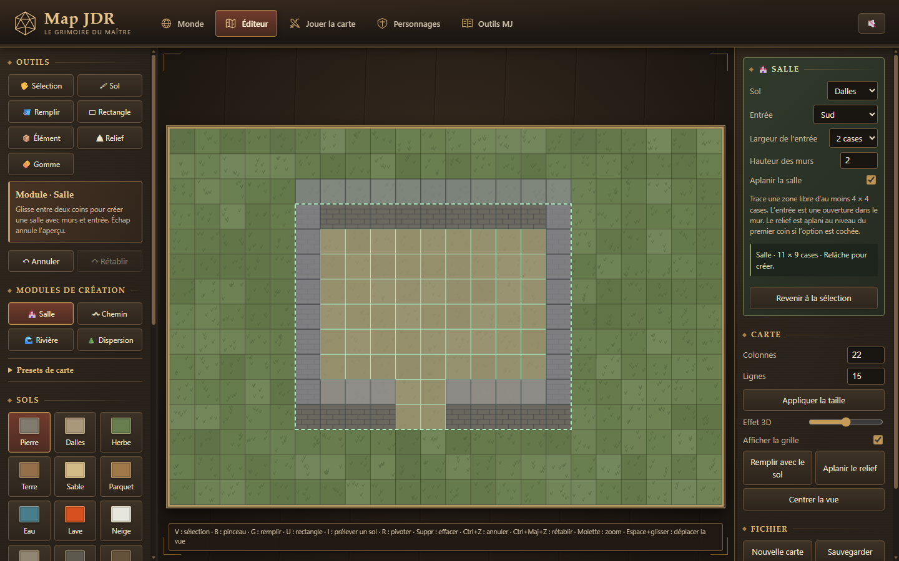 | 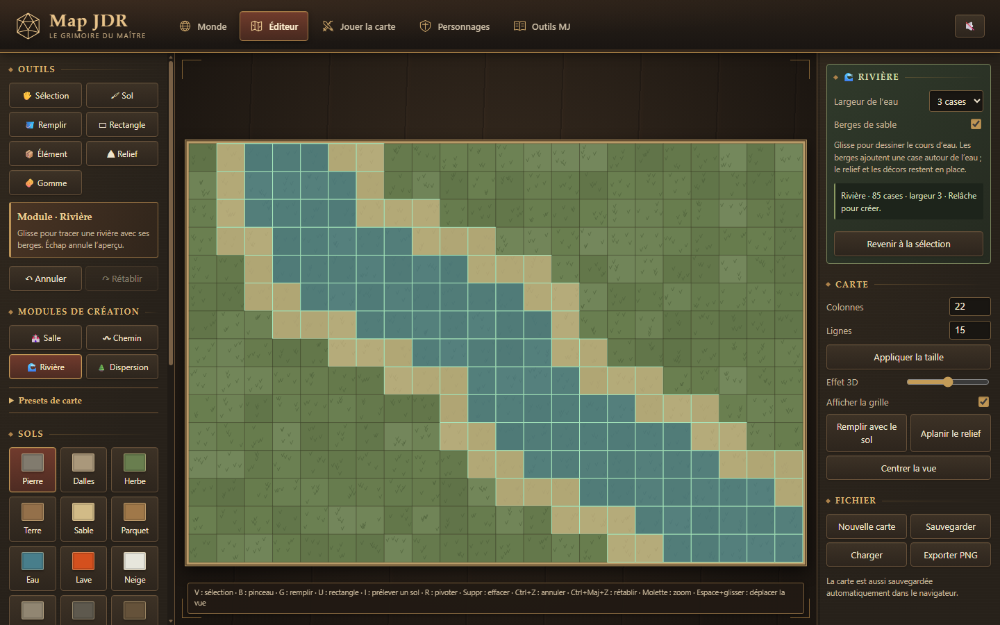 |

### Presets

Ouvre la section **Presets de carte** à gauche pour accéder aux dix décors générés aléatoirement, avec du relief : **chaque clic donne une nouvelle variante**
(décocher « Ajouter le décor » pour ne garder que le sol et les murs).

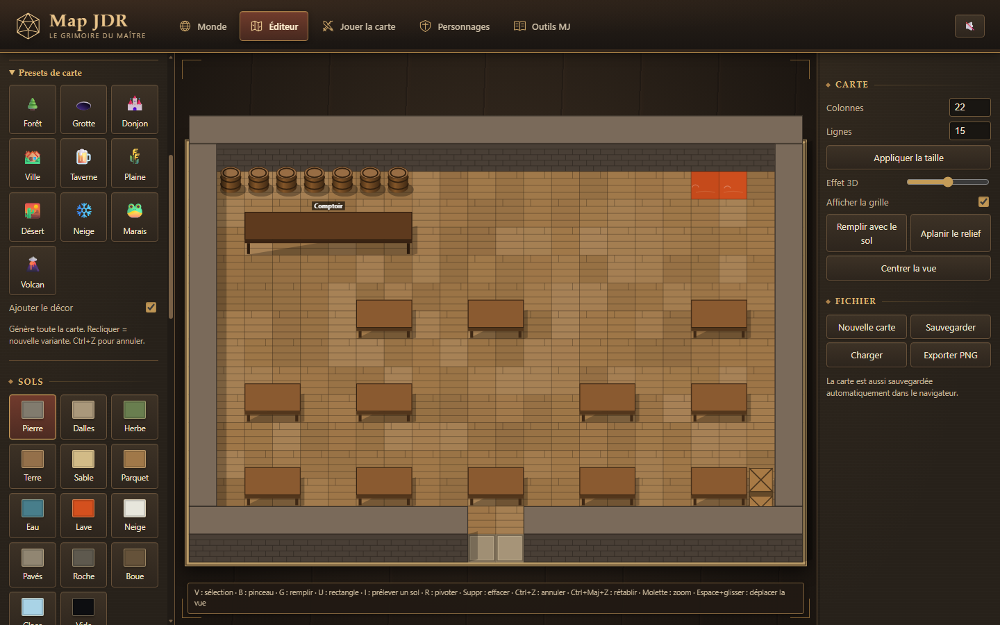

### Relief

Chaque case a un **niveau de 0 à 8** (1 niveau ≈ 1,5 m), dessiné en plateaux et falaises. Les éléments et les figurines
montent avec le terrain. Une figurine peut aussi se tenir **sur** une caisse, une table ou un rocher : sa hauteur s'additionne.

<div align="center">

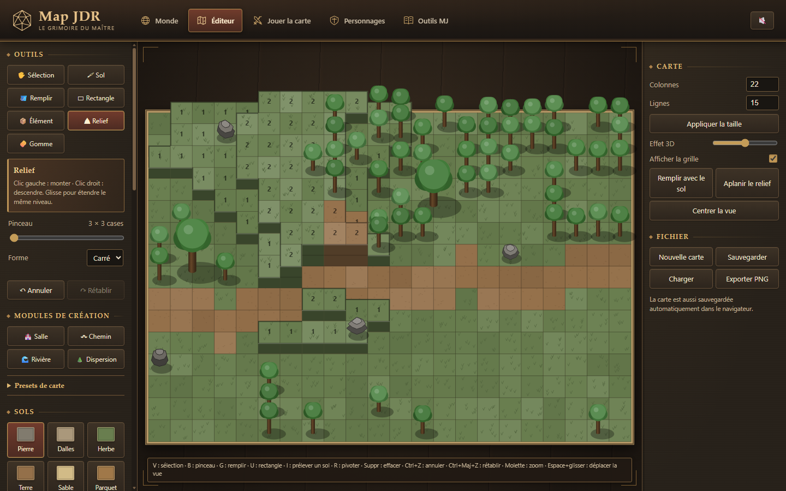

</div>

---

## 🧙 Les personnages


Une fiche contient l'identité (nom, **camp** joueur ou ennemi/PNJ, race, classe, niveau 1 à 20, figurine),
les caractéristiques, les valeurs de combat, la progression, l'équipement et des notes.
Quatre héros d'exemple sont créés au premier lancement : Aldric, Lyra, Brom et Ysolde.

### Caractéristiques

FOR, DEX, CON, INT, SAG, CHA, avec trois méthodes :

- **Répartition de 27 points** (valeurs de 8 à 15, compteur de points restants) ;
- **Tableau standard** 15, 14, 13, 12, 10, 8 ;
- **🎲 Lancer 4d6** en gardant les 3 meilleurs dés (le détail des jets est affiché).

Les valeurs sont réparties automatiquement selon la classe (la meilleure sur la caractéristique principale, encadrée),
puis ajustables avec − / +. Les bonus de race s'ajoutent.

### Races

| Race | Bonus | Déplacement |
| --- | --- | --- |
| Humain | +1 à tout | 6 cases (9 m) |
| Elfe | DEX +2, SAG +1 | 7 cases |
| Nain | CON +2, FOR +1 | 5 cases |
| Halfelin | DEX +2, CHA +1 | 5 cases |
| Demi-orc | FOR +2, CON +1 | 6 cases |
| Gnome | INT +2, CON +1 | 5 cases |
| Tieffelin | CHA +2, INT +1 | 6 cases |
| Drakéide | FOR +2, CHA +1 | 6 cases |

### Classes

| Classe | Dé de vie | Armure (CA) | Arme | Portée | Capacités |
| --- | --- | --- | --- | --- | --- |
| Guerrier | d10 | 18 (cotte de mailles + bouclier) | Épée longue 1d8 (FOR) | 1 | 💪 Second souffle |
| Barbare | d12 | 10 + DEX + CON | Hache à deux mains 1d12 (FOR) | 1 | 😡 Rage |
| Paladin | d10 | 18 | Marteau de guerre 1d8 (FOR) | 1 | 🙌 Imposition des mains, 🌟 Bénédiction |
| Rôdeur | d10 | 12 + DEX | Arc long 1d8 (DEX) | 8 | 🏹 Volée de flèches · escalade 2, nage |
| Voleur | d8 | 11 + DEX | Rapière 1d8 (DEX) | 1 | 🗡 Attaque sournoise · escalade 2 |
| Mage | d6 | 10 + DEX | Trait de feu 1d10 (sort) | 6 | ✨ Projectile magique, 🔥 Boule de feu |
| Clerc | d8 | 18 | Masse d'armes 1d6 (FOR) | 1 | 💚 Soins, 🗣 Mot de guérison, 🌟 Bénédiction |

### Valeurs de combat calculées

| Valeur | Calcul |
| --- | --- |
| Points de vie | dé de vie + mod. CON au niveau 1, puis (moitié du dé + 1 + mod. CON) par niveau |
| Maîtrise | +2 au niveau 1, +1 tous les 4 niveaux |
| Bonus de toucher | maîtrise si l’arme est maîtrisée + mod. de la caractéristique d’attaque + bonus magique |
| Dégâts | dé de l'arme + mod. (sans mod. pour un sort) |
| Initiative | mod. DEX |
| Déplacement, portée, escalade, nage, vol | selon la race, la classe et l’équipement |

Chaque valeur peut être **modifiée à la main** (bordure violette, valeur calculée rappelée) ; **↺ Recalculer** revient au calcul.

### Progression

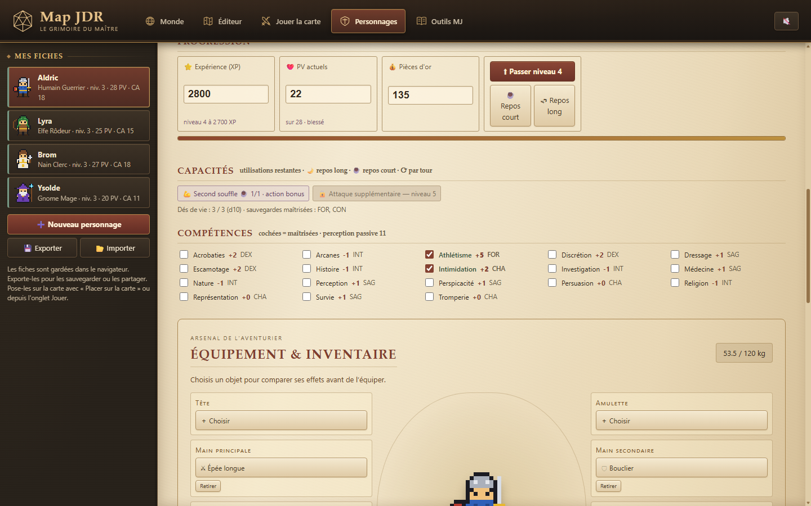

- **XP** avec barre de progression vers le niveau suivant (table de D&D 5e : 300, 900, 2 700, 6 500... XP)
  et bouton **⬆ Passer niveau X** (les PV maximum augmentent) ;
- **PV actuels**, conservés d'un combat à l'autre ; **🛏 Repos long** les remet au maximum ;
- **pièces d'or** et **inventaire** ;
- pour une fiche **ennemi / PNJ**, le champ XP indique l'expérience rapportée quand il est vaincu.

### Capacités, compétences, objets et repos

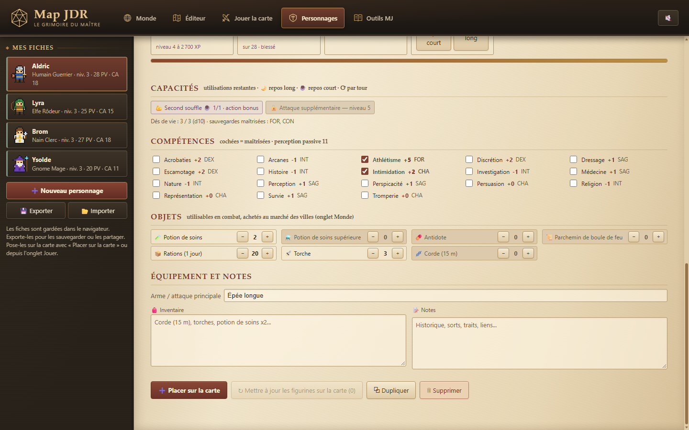

- **Capacités** de la classe avec leurs **utilisations restantes**, conservées d'un combat à l'autre et récupérées au
  repos (🌙 repos long, ☕ repos court, ⟳ une fois par tour). Certaines se **débloquent avec le niveau**
  (🏹 Volée de flèches au niveau 2, 🔥 Boule de feu au niveau 3, ⚔ attaque supplémentaire au niveau 5 pour
  guerrier, barbare, paladin et rôdeur). Le passage de niveau annonce les nouveautés.
- **Dés de vie** (un par niveau) dépensés au repos court pour regagner des PV ; **sauvegardes maîtrisées** de la classe.
- **18 compétences** (Perception, Discrétion, Athlétisme, Persuasion...) à cocher, avec leur bonus et la
  **perception passive**. Celles de la classe sont cochées par défaut.
- **Objets** chiffrés (potions, antidote, parchemin de boule de feu, rations, torches, corde), utilisables en combat.

Boutons : **➕ Placer sur la carte**, **↻ Mettre à jour les figurines sur la carte** (après une modification de la fiche),
**⧉ Dupliquer**, **🗑 Supprimer**, **💾 Exporter / 📂 Importer** les fiches.

### Équipement et inventaire

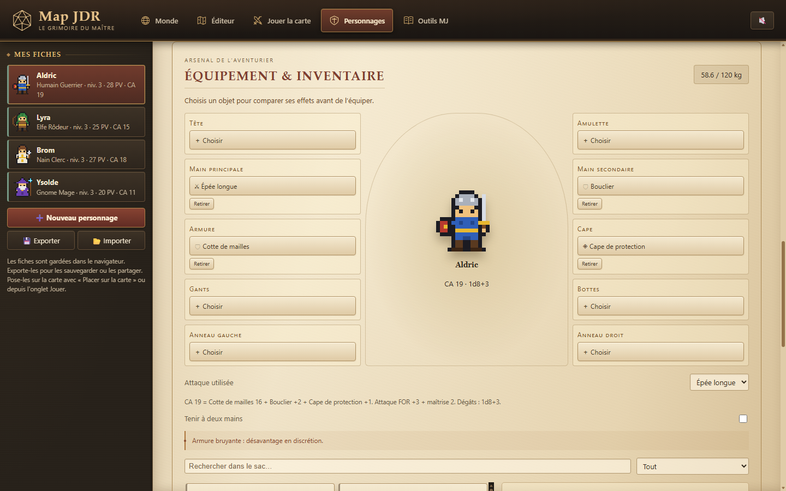

La fiche propose **10 emplacements** : main principale, main secondaire, armure, tête, cape, gants, bottes,
amulette et deux anneaux. Chaque personnage reçoit un équipement de départ adapté à sa classe.
Le sac distingue les objets **possédés**, **équipés** et **harmonisés**, ainsi que l’attaque actuellement utilisée.

| Fonction | Utilisation |
| --- | --- |
| Armes et armures | 55 équipements, dont armes à une ou deux mains, armes de finesse, armes de lancer, arcs, arbalètes, boucliers et trois catégories d’armure. |
| Comparaison | Cliquer sur un objet affiche la CA, le toucher, les dégâts et la portée avant / après. Équiper par bouton ou glisser sur un emplacement. |
| Combat | L’arme détermine le type de dégâts, la caractéristique, la portée et l’animation. Choisir parmi les armes tenues, le trait de feu du mage ou les mains nues. Deux armes légères autorisent une attaque secondaire avec l’action bonus. |
| Deux mains | Une arme à deux mains range l’objet secondaire ; il faut la retirer avant de reprendre un bouclier. Une arme polyvalente peut être tenue à deux mains si la main secondaire est libre. |
| Maîtrise | Une arme non maîtrisée perd le bonus de maîtrise ; armure ou bouclier non maîtrisé impose le désavantage aux attaques. Une armure bruyante pénalise la discrétion. |
| Objets magiques | Armes +1 à +3, protections, résistances, bonus de déplacement ou de compétences et pouvoirs à charges. Trois harmonisations maximum ; les charges reviennent au repos long. |
| Personnalisation MJ | Créer un objet depuis un modèle : nom, description, rareté, poids, prix, dégâts, portée, bonus, résistance et pouvoir. L’armurerie permet aussi d’attribuer gratuitement du matériel. |
| Échanges | Donner un exemplaire à un autre personnage, transférer une quantité de fournitures, déposer au coffre commun ou sur la carte. Une arme lancée est récupérable depuis les objets déposés sur la carte. |
| Commerce | Les marchés vendent du matériel adapté au lieu ; les capitales proposent aussi les objets magiques. Revente à moitié du prix local, modifié par la réputation. Retirer un objet avant de le vendre. |
| Butin | Les trésors générés, découvertes en voyage et récompenses de combat peuvent rejoindre le coffre commun. Une même récompense ne se récupère qu’une fois. |

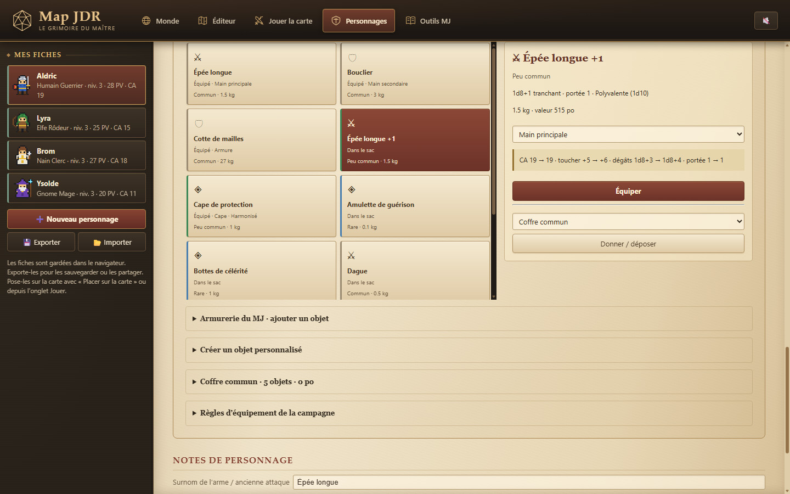

**Règles de cette application** : en combat, changer l’équipement coûte une action bonus ; choisir une attaque déjà disponible est gratuit.
En mode strict, armures, accessoires, harmonisations, commerce et transferts se gèrent hors combat.
Les accessoires ordinaires n’ajoutent pas automatiquement de CA. Les valeurs de combat personnalisées par le MJ restent prioritaires.

Trois options de campagne sont disponibles dans la fiche : **munitions décomptées**, **surcharge** et **usure**.
La capacité est FOR × 7,5 kg ; la surcharge retire 2 cases de déplacement. Le poids est toujours affiché.
Avec l’usure, une attaque retire 1 point d’état à l’arme ; recevoir des dégâts use l’armure et le bouclier.
À 0/100, l’arme ne peut plus attaquer et une protection ne contribue plus à la CA. Les marchés réparent les objets,
pour une part du prix local proportionnelle à l’usure (25 % du prix pour une réparation complète).
Les anciennes notes d’inventaire restent conservées comme texte libre ; leur contenu n’est pas ajouté automatiquement au sac.

Les consommables et charges sont synchronisés entre fiche et figurines ; **Ctrl+Z / Ctrl+Maj+Z** annule ou rétablit les opérations.
La simulation utilise des copies et ne consomme pas les objets réels. Fiches exportées : équipement individuel ; campagne exportée : équipement,
coffre commun, options, monde et itinéraire.

---

## 🎲 Jouer un combat

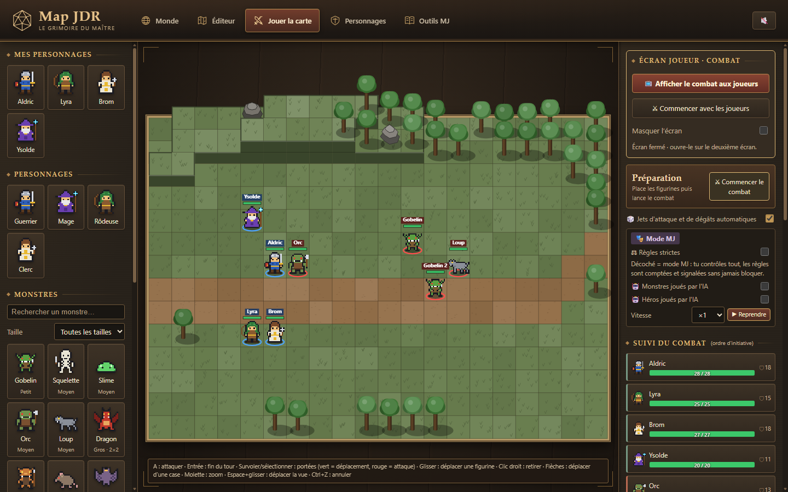

### Placer les figurines

À gauche : **Mes personnages** (les fiches), puis les **personnages** et **monstres** de base. Choisis une figurine puis
clique sur la carte (**Maj+clic** pour en poser plusieurs). Glisser pour déplacer, clic droit pour retirer.

Le bestiaire comprend **21 monstres**, dont **15 nouveaux**. La recherche accepte les noms sans accents ;
le filtre **Taille** affiche les petits, moyens ou gros monstres. Chaque bouton indique sa catégorie et,
pour les gros, son empreinte sur la grille.

| Nouveaux petits · 1 × 1 case | Nouveaux moyens · 1 × 1 case | Nouveaux gros |
| --- | --- | --- |
| Kobold | Bandit | Ogre · 2 × 2 |
| Rat géant | Zombie | Troll · 2 × 2 |
| Chauve-souris | Goule | Minotaure · 2 × 2 |
| Diablotin | Gnoll | Golem de pierre · 2 × 2 |
| Scarabée de feu | Homme-lézard | Géant des collines · 3 × 3 |

Les petits ont une silhouette compacte ; petits et moyens occupent une case. Les gros doivent disposer
de toute leur surface pour se déplacer : un géant ne traverse pas un couloir de deux cases de large.
Chaque ajout possède ses statistiques, son attaque animée et ses habitats dans le générateur de rencontres.
Les valeurs sont ajustables pour cette application dans `data/caracteristiques.txt`, y compris hors ligne.

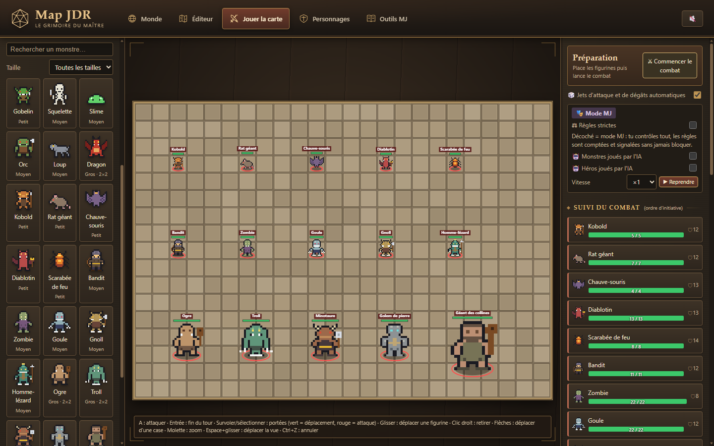

<div align="center">

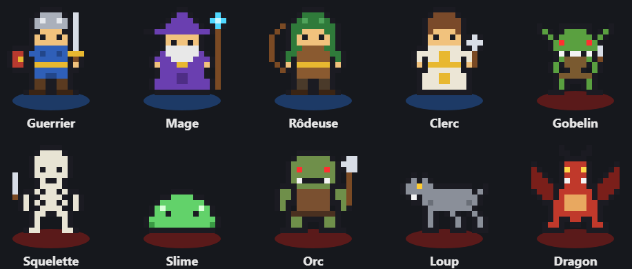

</div>

Socle **bleu** pour les personnages, **rouge** pour les monstres. Au-dessus de chaque figurine : barre de PV, nom,
hauteur (`▲2`) et états. Quand une figurine est sélectionnée, les autres affichent leur hauteur relative
(`▲ +1` / `▼ −2`) et le panneau indique qui **domine** qui.

**Statistiques des figurines de base** (modifiables dans [le fichier de caractéristiques](#-le-fichier-de-caractéristiques)) :

| Figurine | Dépl. | Portée | PV | CA | Toucher | Dégâts | Init. | XP | Particularités |
| --- | --- | --- | --- | --- | --- | --- | --- | --- | --- |
| Guerrier | 5 | 1 | 28 | 18 | +5 | 1d8+3 | +1 | | |
| Mage | 5 | 6 | 16 | 12 | +5 | 1d10 | +2 | | |
| Rôdeuse | 6 | 8 | 24 | 15 | +6 | 1d8+3 | +3 | | escalade 2, nage |
| Clerc | 5 | 1 | 22 | 18 | +4 | 1d6+2 | +0 | | |
| Gobelin | 6 | 1 | 7 | 15 | +4 | 1d6+2 | +2 | 50 | |
| Squelette | 5 | 1 | 13 | 13 | +4 | 1d6+2 | +2 | 50 | |
| Slime | 3 | 1 | 22 | 8 | +3 | 1d6+1 | −2 | 100 | ne grimpe pas, nage |
| Orc | 6 | 1 | 15 | 13 | +5 | 1d12+3 | +1 | 100 | |
| Loup | 8 | 1 | 11 | 13 | +4 | 2d4+2 | +2 | 50 | nage |
| Dragon | 8 | 3 | 75 | 17 | +7 | 2d10+4 | +0 | 2 300 | 2×2 cases, vol, 🐉 souffle de feu |
| Kobold | 6 | 1 | 5 | 12 | +4 | 1d4+2 | +2 | 25 | petit, meute, fuite agile |
| Rat géant | 6 | 1 | 7 | 12 | +4 | 1d4+2 | +2 | 25 | petit, nage, meute |
| Chauve-souris | 8 | 1 | 4 | 13 | +3 | 1d4+1 | +3 | 10 | petite, vol, fuite agile |
| Diablotin | 8 | 4 | 13 | 13 | +5 | 1d6+3 | +3 | 100 | petit, vol, dard de poison |
| Scarabée de feu | 4 | 1 | 8 | 14 | +3 | 1d6+1 | +0 | 25 | petit, dégâts et résistance au feu |
| Bandit | 6 | 6 | 11 | 12 | +3 | 1d6+1 | +1 | 25 | arc |
| Zombie | 4 | 1 | 22 | 8 | +3 | 1d6+1 | −2 | 50 | ne grimpe pas, sans peur, immunité au poison |
| Goule | 6 | 1 | 22 | 12 | +4 | 2d4+2 | +2 | 200 | escalade 2, fuite agile, immunité au poison |
| Gnoll | 6 | 1 | 22 | 15 | +4 | 1d8+2 | +1 | 100 | meute, agressif |
| Homme-lézard | 6 | 1 | 27 | 15 | +4 | 1d6+2 | +0 | 200 | nage, 2 attaques |
| Ogre | 6 | 1 | 59 | 11 | +6 | 2d8+4 | −1 | 450 | 2×2 cases, agressif |
| Troll | 6 | 1 | 84 | 15 | +7 | 2d6+4 | +1 | 1 100 | 2×2 cases, nage, escalade 2, 2 attaques |
| Minotaure | 8 | 1 | 76 | 14 | +6 | 2d10+4 | +0 | 700 | 2×2 cases, agressif, renversement |
| Golem de pierre | 4 | 1 | 105 | 17 | +7 | 2d8+5 | −1 | 1 800 | 2×2 cases, 2 attaques, immunité au poison |
| Géant des collines | 6 | 1 | 115 | 13 | +8 | 3d8+5 | −1 | 1 800 | 3×3 cases, 2 attaques, renversement |

### 🟩 Portées de déplacement et d'attaque

Sélectionne ou survole une figurine : **en vert** les cases où elle peut aller ce tour-ci, **en rouge** celles
qu'elle peut attaquer après s'être déplacée. Les ennemis à portée sont entourés de rouge et marqués **⚔**.

<div align="center">


</div>

Le calcul tient compte :

- des **diagonales** : une diagonale coûte 2 cases (tout droit puis à gauche ou à droite) ;
- du **relief** : monter **et** descendre coûtent 1 case de plus par niveau, et on ne grimpe que jusqu'à sa valeur d'**escalade** ;
- des **sols** : boue, neige, glace coûtent 2 cases ; l'eau est réservée aux nageurs ; lave et vide sont infranchissables ;
- des **obstacles** (arbres, murs, maisons, colonnes) et des **ennemis**, qui bloquent ; les alliés et les figurines KO se traversent ;
- pour l'attaque : **+1 case de portée à distance par niveau au-dessus de la cible**, corps à corps impossible si l'écart
  de hauteur dépasse 1 niveau, et **ligne de vue** pour les tirs (murs, maisons, arbres et colonnes la bloquent).

Le mode **Toutes** affiche les zones de toutes les figurines. Le déplacement part de la position en **début de tour**
(affichée en pointillés) ; le panneau indique les cases utilisées (« 3 / 5 cases »).

### Déroulement d'un combat

1. **Préparation** : place les figurines librement.
2. **⚔ Commencer le combat** : chaque figurine lance son **initiative** (d20 + bonus) ; l'ordre s'affiche dans le suivi.
3. La figurine active a un **anneau doré** et une flèche ; sa zone de déplacement repart de zéro.
4. **⏭ Fin du tour** (ou **Entrée**) passe à la suivante ; après la dernière, un nouveau **round** commence.
5. Fin : **🏁 Terminer** (XP et PV enregistrés), **↺ Recommencer** (positions de départ, PV pleins, nouvelle initiative)
   ou **⏹ Nouveau combat** (retour en préparation).

Une figurine ajoutée en cours de combat lance son initiative et prend sa place dans l'ordre.

### ⚖ Mode MJ ou règles strictes

| | 🎭 **Mode MJ** (par défaut) | ⚖ **Règles strictes** |
| --- | --- | --- |
| Déplacement | Libre, n'importe quelle figurine, n'importe quand | Seulement la figurine dont c'est le tour, dans sa zone verte |
| Actions | Comptées et affichées, jamais bloquées (✋ MJ si on dépasse) | Une action, une action bonus, une réaction par tour |
| Attaques d'opportunité | Signalées dans le journal : à toi de décider | Résolues automatiquement |
| Se relever | Le MJ retire l'état « À terre » | Automatique au début du tour (moitié du déplacement) |

Dans les deux modes, tu peux toujours modifier les PV, les états, les positions (en préparation) et annuler (**Ctrl+Z**).
Les figurines jouées par l'IA appliquent toujours les règles.

<div align="center">

| Règles et IA | Figurine : actions du tour | Journal de l'IA |
| --- | --- | --- |
| 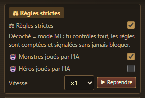 | 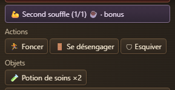 | 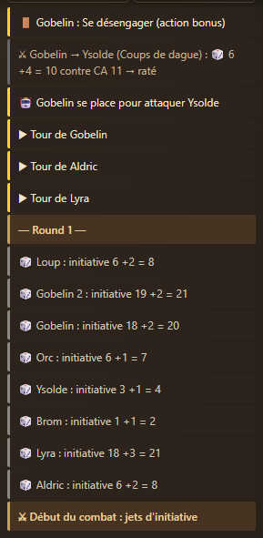 |

</div>

### 🎯 Actions du tour

Le panneau de la figurine affiche ● **Action** ● **Bonus** ● **Réaction** (vides une fois utilisées).

| Action | Coût | Effet |
| --- | --- | --- |
| ⚔ Attaquer | action | 1 attaque, 2 avec l'attaque supplémentaire (niveau 5) ou la multiattaque d'un monstre |
| 🏃 Foncer | action | Déplacement doublé |
| 🚪 Se désengager | action (bonus pour le gobelin) | Pas d'attaque d'opportunité ce tour |
| 🛡 Esquiver | action | Désavantage aux attaques contre soi jusqu'à son prochain tour |
| 🧪 Potion / 💊 antidote | action bonus | Rend des PV / guérit le poison |
| 📜 Parchemin | action | Lance le sort du parchemin (usage unique) |
| Capacités | action ou bonus | Voir le tableau des capacités |
| ⚡ Attaque d'opportunité | réaction | Quand un ennemi quitte le contact sans s'être désengagé |

**Abri** : une attaque à distance contre une cible abritée derrière un obstacle ou une autre créature subit
**+2 à la CA** (indiqué dans le journal).

### 🧬 Statistiques complètes

Chaque figurine a ses **6 caractéristiques**, ses **sauvegardes** (sorts de zone en DEX, concentration en CON,
renversement en FOR), un **type de dégâts** et éventuellement des **résistances** (moitié), **immunités** (aucun)
et **vulnérabilités** (double). Les fiches les calculent ; les figurines de base les lisent dans le fichier TXT.

| Monstre | Particularités |
| --- | --- |
| Gobelin | **Fuite agile** : se désengage en action bonus et recule après avoir frappé |
| Squelette | **Vulnérable** aux dégâts contondants, **immunisé** au poison |
| Slime | **Immunisé** à l'acide, **résistant** au feu et au froid ; dégâts d'acide |
| Orc | **Agressif** : fonce vers l'ennemi en action bonus |
| Loup | **Tactique de meute** (avantage si un allié est au contact de la cible), **renversement** (FOR DD 11 ou à terre) |
| Dragon | **Multiattaque** (2 attaques), **immunisé** au feu, **souffle** qui se recharge sur 5-6, ne fuit jamais |
| Kobold | **Meute** et **fuite agile** : combat au contact avec ses alliés, puis peut se désengager |
| Rat géant | **Meute**, nage et morsure perforante |
| Chauve-souris | **Vol** et **fuite agile** ; morsure au contact |
| Diablotin | **Vol**, dard de poison à distance, **immunisé** au feu et au poison, **résistant** au froid |
| Scarabée de feu | Mandibules infligeant des dégâts de **feu**, **résistant** au feu |
| Bandit | Arc à **6 cases** ; l’IA cherche une position de tir |
| Zombie | **Immunisé** au poison, ne fuit jamais ; lent et incapable de grimper |
| Goule | **Immunisée** au poison, **fuite agile**, escalade de 2 niveaux, ne fuit jamais |
| Gnoll | **Meute** et **agressif** : fonce en action bonus |
| Homme-lézard | Nage, lance et **2 attaques** par action |
| Ogre | **Agressif**, massue à 2d8+4, empreinte de **2 × 2 cases** |
| Troll | Nage, escalade de 2 niveaux, **2 attaques**, ne fuit jamais |
| Minotaure | **Agressif** et **renversement** contre les cibles d’une case |
| Golem de pierre | **2 attaques**, **immunisé** au poison, ne fuit jamais |
| Géant des collines | **3 × 3 cases**, **2 attaques**, **renversement** contre les cibles d’une case |

Les monstres très blessés dont le camp perd **prennent la fuite**.

### 💥 Attaques animées

Figurine sélectionnée → **⚔ Attaquer** (ou **A**) → clic sur la cible. Le viseur affiche la **chance de toucher**
et prévient si la cible est hors de portée ou sans ligne de vue.

<div align="center">


</div>

Avec les **🎲 jets automatiques** (activés par défaut) : **d20 + toucher contre la CA**. Un 20 naturel est un
**critique** (dés de dégâts doublés), un 1 naturel rate toujours. Les dégâts s'appliquent à l'impact de l'animation,
le chiffre s'envole au-dessus de la cible ; une attaque ratée la fait **esquiver**.

| Figurine | Attaque | Animation |
| --- | --- | --- |
| Guerrier | Coup d'épée | Bond en avant, arc d'épée lumineux |
| Clerc | Masse sacrée | Onde dorée et rayons de lumière |
| Mage | Projectile magique | Orbe avec traînée, explosion |
| Rôdeuse | Flèche | Flèche en cloche, plantée dans la cible |
| Gobelin | Coups de dague | Deux estocades rapides |
| Squelette | Lame rouillée | Arc d'épée verdâtre |
| Orc | Coup de hache | Grand arc vertical, poussière, tremblement de l'écran |
| Loup | Morsure | Trois griffures rouges |
| Slime | Crachat d'acide | Boule verte, éclaboussures, flaque |
| Dragon | Souffle de feu | Flot de flammes, cible en feu, tremblement de l'écran |
| Kobold | Pointe de lance | Deux estocades rapides aux reflets dorés |
| Rat géant | Morsure de rat | Bond et traces de morsure beige rosé |
| Chauve-souris | Morsure en piqué | Bond vers la cible et griffures violettes |
| Diablotin | Dard venimeux | Projectile vert, traînée et éclaboussures de poison |
| Scarabée de feu | Mandibules brûlantes | Éclat orangé et onde à l’impact |
| Bandit | Flèche de bandit | Flèche en cloche vers la cible |
| Zombie | Coup pesant | Bond lent, éclat et onde verdâtre |
| Goule | Griffes de goule | Trois griffures bleu pâle |
| Gnoll | Hache du gnoll | Arc vertical, poussière et léger tremblement |
| Homme-lézard | Lance reptilienne | Deux estocades vert pâle |
| Ogre | Massue de l’ogre | Onde à l’impact et tremblement de l’écran |
| Troll | Griffes du troll | Griffures vertes et léger tremblement |
| Minotaure | Hache du labyrinthe | Grand arc vertical, poussière et tremblement |
| Golem de pierre | Poing de pierre | Éclat turquoise, onde et fort tremblement |
| Géant des collines | Massue du géant | Impact lent, large onde et fort tremblement |

**Les 15 nouvelles attaques en action** : chaque animation ci-dessous présente successivement les cinq monstres de sa catégorie,
avec leurs jets et leurs dégâts. Le nom du monstre et de son attaque figurent dans le bandeau.

| Petits monstres | Monstres moyens | Gros monstres |
| --- | --- | --- |
| 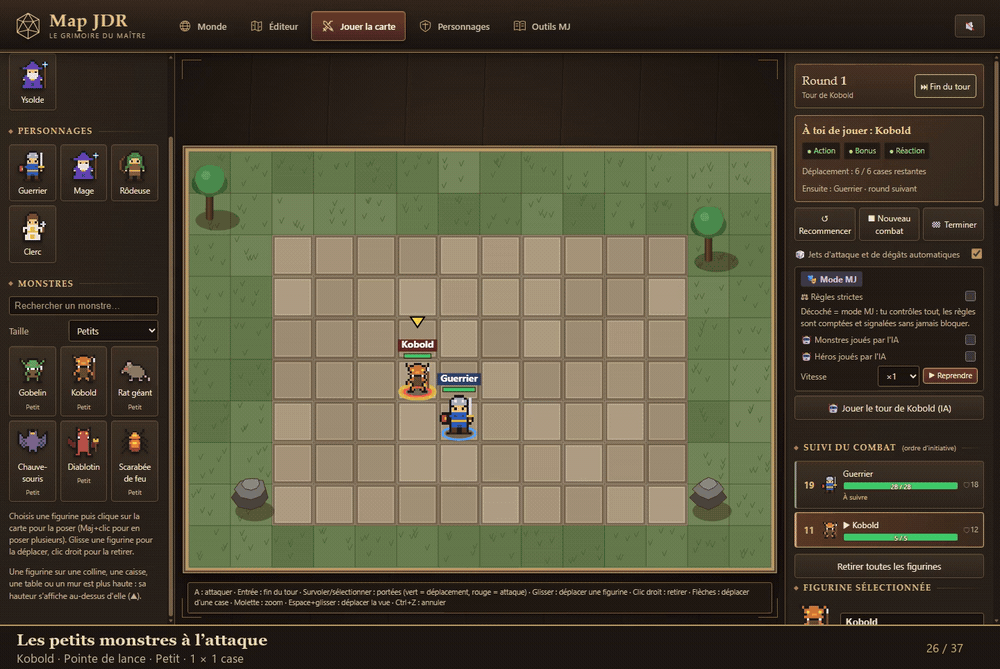 | 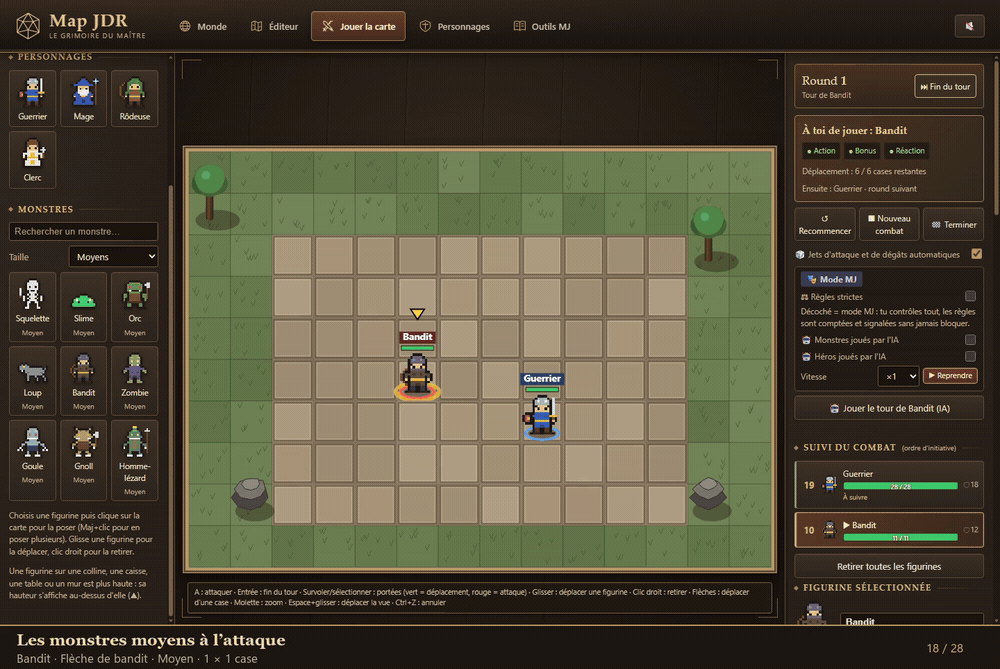 | 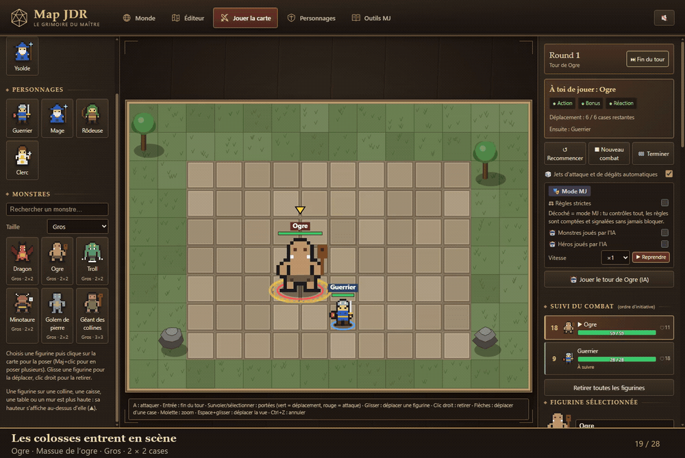 |

Les démonstrations sont aussi incluses dans la [visite guidée en vidéo](docs/visite-guidee.mp4), pour les regarder en grand.

### 🔮 Capacités et sorts

Les capacités de la classe apparaissent sous **⚔ Attaquer**, avec leurs **utilisations restantes pour ce combat**.

| Capacité | Coût | Effet | Utilisations | Récupération |
| --- | --- | --- | --- | --- |
| 💪 Second souffle | bonus | Récupère 1d10 + niveau PV | 1 | ☕ repos court |
| 😡 Rage | bonus | +2 aux dégâts, résistance aux dégâts physiques, 10 rounds | 2 (3 au niv. 3) | 🌙 repos long |
| 🙌 Imposition des mains | action | Soigne 5 × niveau PV à un allié au contact | 1 | 🌙 |
| 🏹 Volée de flèches (niv. 2) | action | Zone de 3×3 cases à 8 cases, 1d8 + mod. perforants | 1 | ☕ |
| 🗡 Attaque sournoise | attaque | (niveau ÷ 2) d6 en plus, si un allié est au contact de la cible ou avec avantage | 1 par tour | ⟳ |
| ✨ Projectile magique | action | 3 traits de force qui touchent toujours, 1d4+1 chacun | 2 + niveau ÷ 2 | 🌙 |
| 🔥 Boule de feu (niv. 3) | action | Zone de 2 cases de rayon à 8 cases, (2 + niveau ÷ 2) d6 de feu | 1 (2 au niv. 5) | 🌙 |
| 💚 Soins | action | Soigne 1d8 + mod. à un allié au contact | 1 + niveau ÷ 2 | 🌙 |
| 🗣 Mot de guérison | bonus | Soigne 1d4 + mod. à un allié à 6 cases | 1 + niveau ÷ 2 | 🌙 |
| 🌟 Bénédiction | action | +1d4 aux attaques des alliés de la zone, 10 rounds, **concentration** | 1 | 🌙 |
| 🐉 Souffle de feu (dragon) | action | Zone de 2 cases de rayon, 6d6 de feu, DD 14 | 1 | 🎲 recharge sur 5-6 |

Les fiches gardent leurs utilisations restantes d'un combat à l'autre ; les figurines de base et les monstres les
récupèrent à chaque combat. **Concentration** : un lanceur blessé fait une sauvegarde de CON (DD 10 ou moitié
des dégâts) pour maintenir son sort.

Les sorts de zone affichent un **gabarit** : portée du lanceur, zone, figurines touchées, et un avertissement
si des **alliés** sont dedans. Chaque cible fait un **jet de sauvegarde de DEX** contre le DD du lanceur
(8 + bonus de toucher) : moitié des dégâts si elle réussit.

<div align="center">

| Visée | Impact |
| --- | --- |
| 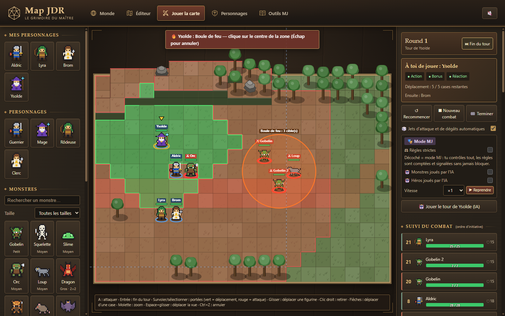 |  |

</div>

### 🧪 États

Cliquables dans le panneau de la figurine ; leurs icônes s'affichent au-dessus d'elle.

| État | Effet appliqué automatiquement |
| --- | --- |
| 🤢 Empoisonné | Désavantage à ses attaques |
| 💫 Étourdi | Passe son prochain tour, ne bouge pas ; on l'attaque avec avantage |
| ⛓️ Entravé | Ne bouge pas ; on l'attaque avec avantage |
| ⤵️ À terre | Désavantage à ses attaques ; avantage au contact contre lui, désavantage de loin |
| 🙈 Aveuglé | Désavantage à ses attaques ; on l'attaque avec avantage |
| 😱 Effrayé | Désavantage à ses attaques |
| 🔥 En feu | 1d6 dégâts au début de son tour |
| 👻 Invisible | Avantage à ses attaques ; désavantage contre lui |
| 🧠 Concentration | Rappel visuel (sort maintenu) |
| 🌟 Béni | +1d4 à ses jets d'attaque |
| 😡 Rage | +2 aux dégâts au contact, résistance aux dégâts tranchants, perforants et contondants |
| 🛡 Esquive | Désavantage aux attaques contre lui jusqu'à son prochain tour |

Les états posés par les capacités ont une **durée** en rounds et disparaissent seuls (« ⌛ ... prend fin »).

**Avantage / désavantage** : on lance 2d20 et on garde le meilleur ou le pire ; ils s'annulent. Le journal indique
les deux dés et la raison. Une figurine **cachée** qui attaque se révèle.

### 💀 Jets contre la mort

Un personnage à 0 PV tombe **inconscient** (couché, grisé) au lieu de mourir. Au début de chacun de ses tours,
il lance un d20 :

- **10 ou plus** : réussite ; **moins de 10** : échec ; **1** : deux échecs ; **20** : il se relève avec 1 PV ;
- **3 réussites** : stabilisé 🩹 ; **3 échecs** : mort ⚰ ;
- chaque coup reçu à terre est un échec (deux sur un critique), et une attaque **au contact** contre lui est un critique ;
- un soin le relève immédiatement.

Le suivi affiche ses jets (`✔✖✖`). Les monstres à 0 PV sont simplement hors de combat.

### 🤖 Intelligence artificielle

Chaque figurine est jouée **par le MJ** (par défaut) ou **par l'IA** :

- options **🤖 Monstres joués par l'IA** et **🤖 Héros joués par l'IA** ;
- réglage **Contrôle** par figurine (🎭 MJ, 🤖 IA ou selon l'option du camp) : par exemple un PNJ allié à l'IA ;
- bouton **🤖 Jouer le tour de...** pour faire jouer une seule fois la figurine active ;
- **vitesse** ×0,5 à ×4 et **⏸ Pause**. Avec les deux options cochées, le combat se joue tout seul : **mode spectateur**.

L'IA joue selon le **rôle** de la figurine (réglable dans son panneau) :

| Rôle | Comportement |
| --- | --- |
| 🛡 Tank (guerrier, barbare, paladin) | Va au contact, protège les alliés menacés, rage dès le premier tour |
| 💚 Soigneur (clerc) | Relève les alliés à terre, soigne sous la moitié des PV, bénit le groupe, puis attaque |
| 🔥 Lanceur de sorts (mage) | Boule de feu si au moins 2 ennemis sans allié, sinon projectile magique sur le plus faible |
| 🏹 Tireur (rôdeur, monstres à distance) | Garde ses distances, cherche la hauteur, volée de flèches sur les groupes |
| 🗡 Escarmoucheur (voleur) | Attaque les ennemis déjà au contact d'un allié (attaque sournoise) |
| 💥 Brute (monstres) | Vise les cibles faibles ; tactique de meute, renversement, fuite selon ses traits |

Tous boivent une potion sous 35 % de PV s'ils en ont, visent en priorité soigneurs et lanceurs de sorts, et
**foncent** si personne n'est à portée.

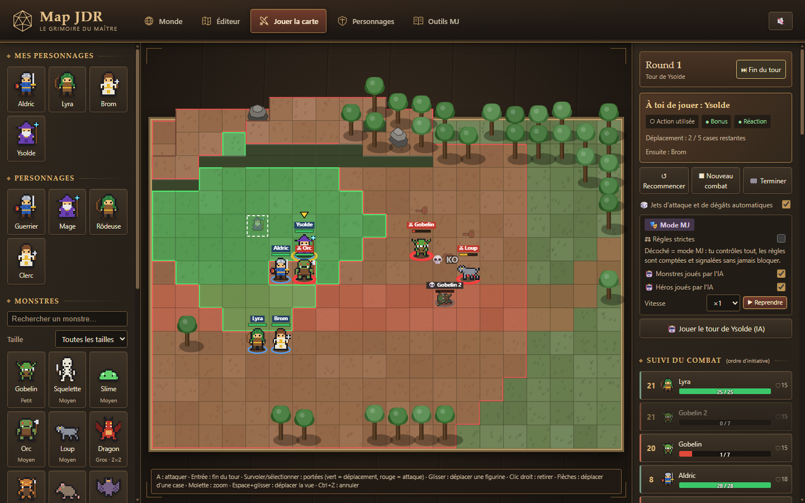

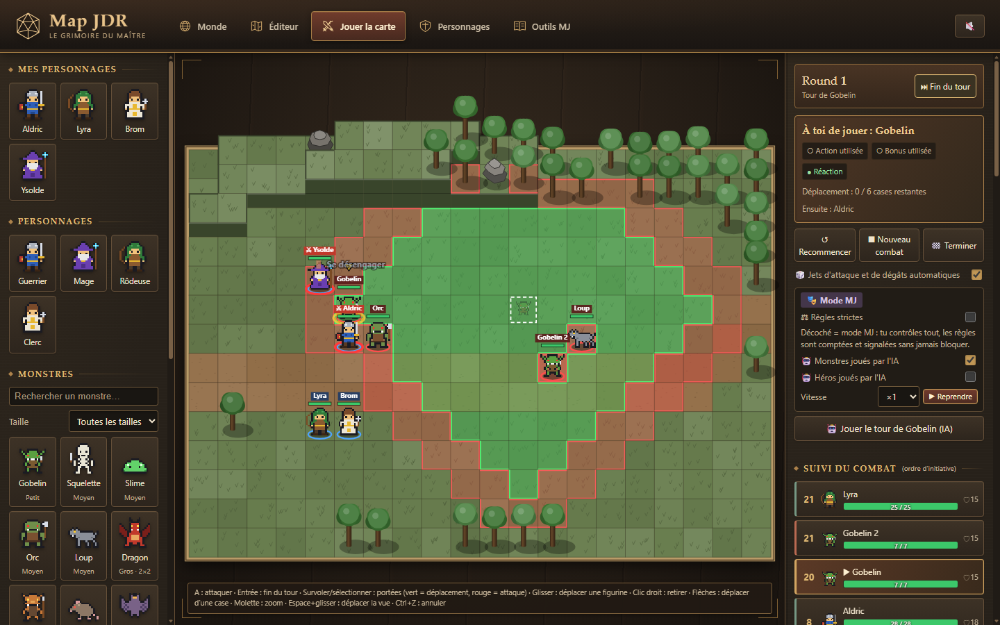

### 📊 Le panneau de suivi

<div align="center">

| Ordre d'initiative | Figurine sélectionnée | Dés, bilan, journal |
| --- | --- | --- |
| 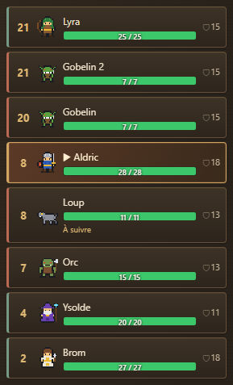 | 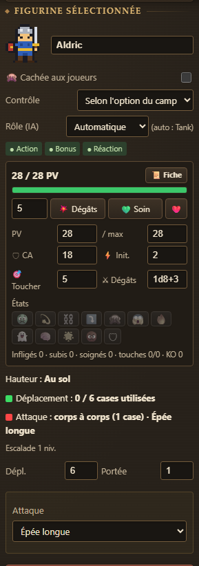 | 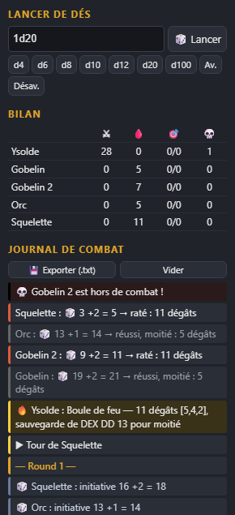 |

</div>

- **Suivi du combat** : ordre d'initiative, figurine active, PV, CA, états, jets contre la mort. Survoler une ligne
  donne les statistiques de la figurine.
- **Figurine sélectionnée** : PV (**💥 Dégâts**, **💚 Soin**, **❤️ PV au max**), CA, initiative, toucher, dégâts, états,
  **🙈 Cachée aux joueurs**, statistiques (infligés, subis, soignés, touches, KO), hauteur, déplacement utilisé,
  attaque, capacités, **↺ Retour au départ du tour**, hauteur relative face aux ennemis.
- **Lancer de dés** : formule libre (`2d6+3`, `1d8+1d6-1`), d4 à d100, d20 avec avantage ou désavantage.
- **Bilan** : dégâts infligés et subis, touches, KO par figurine.
- **Journal de combat** : initiative, jets détaillés, dégâts, sauvegardes, soins, états, KO, victoire ; **💾 Exporter (.txt)**.

### 🏁 Fin du combat et expérience

**🏁 Terminer** partage l'**XP des ennemis vaincus** entre les personnages, enregistre leurs **PV** (et leur mort
éventuelle) sur les fiches, et signale ceux qui peuvent **monter de niveau**. La **🏆 victoire** est annoncée quand
tous les ennemis sont hors de combat.

---

## 🧪 Simulateur de combat

**🧪 Simuler ce combat** (onglet Jouer), **🧪 Tester (simulation)** (générateur de rencontres) ou **🧪 Simuler**
(rencontre en voyage) joue le combat **des dizaines ou des centaines de fois**, toutes les figurines à l'IA, en
règles strictes, sans affichage, sur une **copie** de la carte (relief, obstacles et positions compris).
Ta carte n'est jamais modifiée.


Le rapport donne :

- un **verdict** (Facile, Moyenne, Difficile, Mortelle, Massacre) ;
- la part de **victoires**, de **défaites** et de combats non terminés, et la **durée** en rounds ;
- pour chaque personnage : probabilité de **tomber** et de **mourir**, PV restants, dégâts infligés, ennemis mis KO ;
- pour chaque monstre : probabilité d'être vaincu et dégâts infligés, avec le **plus dangereux**.

Réglages : nombre de combats, rounds maximum, PV pleins ou actuels, **graine** (même graine = mêmes résultats).
Le hasard du jeu est à graine : un combat simulé peut être rejoué à l'identique.

> 💡 Les seuils d'XP du Guide du maître sont une estimation ; la simulation mesure la difficulté **réelle**, sur ta
> carte. Ci-dessous, une rencontre annoncée « difficile » se révèle « moyenne » pour ce groupe.

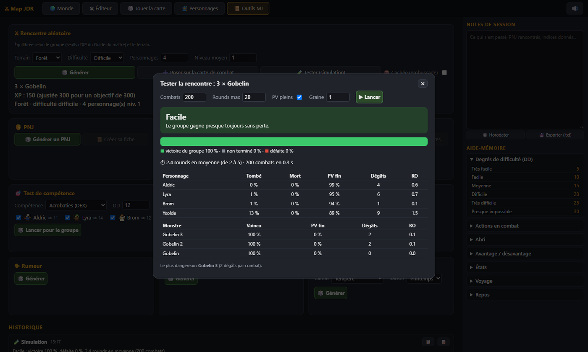

---

## 🎭 Outils du MJ

### 📺 Écran des joueurs et brouillard de guerre

**📺 Ouvrir l'écran des joueurs** ouvre une seconde fenêtre à placer sur la télé ou un 2ᵉ écran. Elle se met à jour
en direct (déplacements, PV, animations, dégâts, sons) et **ne montre que ce que les joueurs doivent voir**.

<div align="center">

| Vue du MJ | Écran des joueurs |
| --- | --- |
| 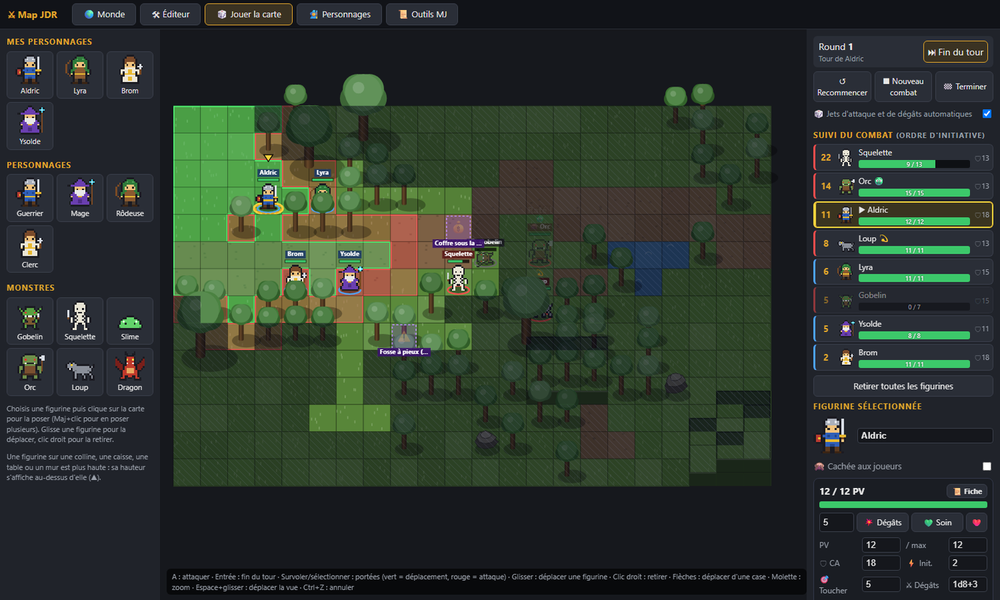 |  |

</div>

| Outil | Détail |
| --- | --- |
| 🌫 **Brouillard de guerre** | Pinceau **🔦 Révéler / 🌫 Cacher** (clic droit = l'inverse), **Tout révéler / Tout cacher** |
| 👁 **Vision automatique** | Révèle ce que voient les personnages selon leur **vision** (en cases) et la **ligne de vue** |
| 🙈 **Figurines cachées** | Transparentes pour le MJ, invisibles pour les joueurs : idéal pour les embuscades |
| 📌 **Marqueurs secrets** | ⚠️ piège, 💰 trésor, 🚪 passage secret, 🔍 indice, ☠️ danger, 📝 note, avec un texte. MJ seulement |
| 👁 **Voir comme les joueurs** | Aperçu, dans la fenêtre du MJ, de l'écran des joueurs |
| 🪤 **Pièges et secrets automatiques** | Un personnage qui passe à 2 cases d'un marqueur piège, passage secret, trésor ou indice le **repère** si sa perception passive atteint le DD écrit dans le texte (« DD 13 »). Un piège non repéré se **déclenche** quand on marche dessus : sauvegarde de DEX, dégâts lus dans le texte (« 2d6 perforant ») |

Côté joueurs : brouillard opaque, rien de ce qui s'y trouve n'est dessiné, figurines cachées invisibles, PV des monstres,
zones de portée et marqueurs masqués, et un bandeau « lieu · round · tour de... ». On y déplace et zoome la vue ; **F** recentre.

### 📜 Onglet Outils MJ


| Générateur | Résultat |
| --- | --- |
| ⚔ **Rencontre aléatoire** | Monstres équilibrés selon le nombre et le niveau des personnages (seuils d'XP du Guide du maître, multiplicateur selon le nombre de monstres) et le terrain (proposé selon le lieu de la carte). **➕ Poser sur la carte de combat** les place loin du groupe, **cachés** si on veut une embuscade ; **🧪 Tester** la simule |
| 🎯 **Test de compétence** | Compétence, DD, normal / avantage / désavantage, personnages concernés (avec leur perception passive) : chacun lance, réussite du groupe si la moitié réussit |
| 🧑 **PNJ** | Nom, race, métier, signe distinctif, caractère, motivation et secret ; **📜 Créer sa fiche** ou **📖 Conserver dans le carnet** |
| 💰 **Trésor** | Or et objets selon le niveau ; **➗ Partager l'or** entre les fiches des personnages |
| 📜 **Quête** | Commanditaire, objectif, lieu de ton monde, complication, récompense ; **📌 Ajouter aux quêtes** du monde |
| 🗣 **Rumeur** | Vraie ou fausse (indiqué au MJ seulement) |
| 🍺 **Taverne** | Nom, tenancier, spécialité, prix, rumeur entendue |
| 🌦 **Météo** | Selon le climat et la saison, avec ses effets en jeu |

Les 30 derniers résultats restent dans l'**historique**, y compris après rechargement (📋 copier, 📝 ajouter aux notes). Le panneau de droite contient les
**notes de session** (🕒 horodatage avec le jour du monde, export `.txt`) et un **aide-mémoire** : degrés de difficulté,
actions en combat, abri, avantage, états, rythme de voyage, repos.

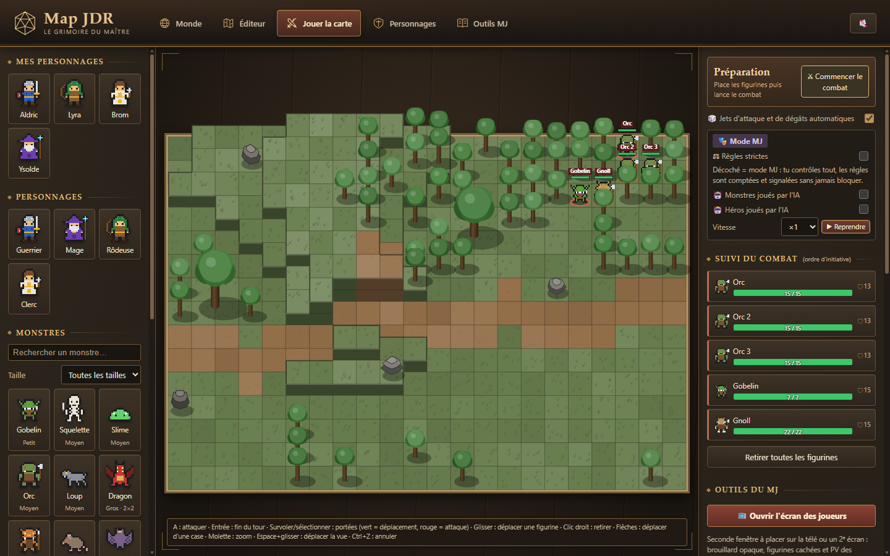

### 📖 Carnet de campagne

Dans **Outils MJ → Carnet de campagne**, quatre rubriques gardent les informations de la partie. Les champs sont
enregistrés automatiquement. La recherche retrouve les noms, lieux, factions et contenus ; **Archiver** masque une
entrée sans l'effacer, et **Afficher les archives → Restaurer** la remet dans la liste.

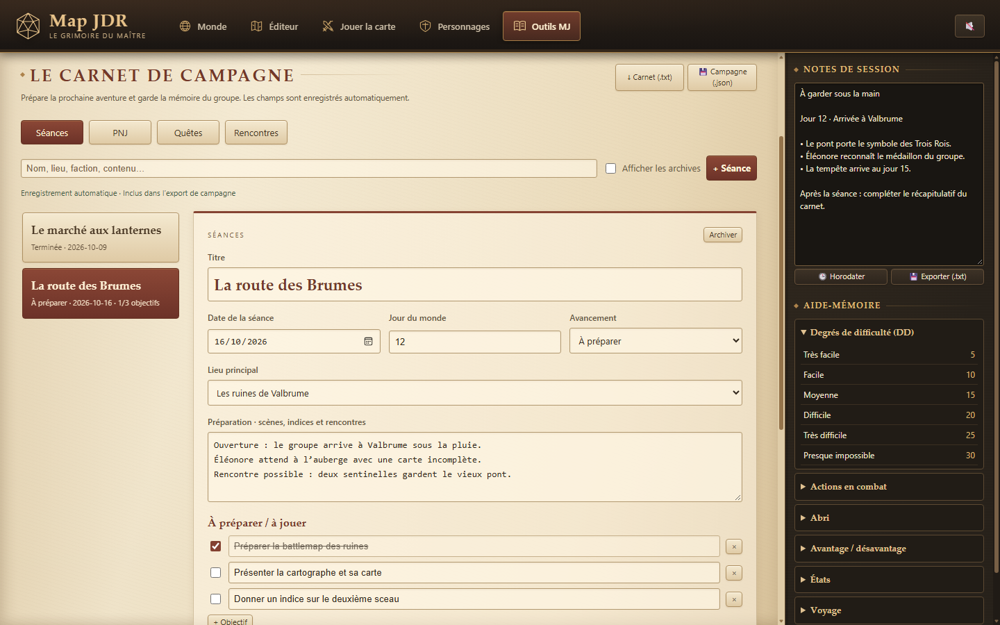

- **Séances** : titre, date réelle, jour du monde, lieu, état (à préparer, en cours, terminée), préparation,
  objectifs à cocher, récapitulatif et pistes pour la suite. **Préparer la séance suivante** reprend les pistes et
  les objectifs inachevés dans une nouvelle entrée ; l'ancienne séance reste intacte. La date et le jour sont des
  repères de notes : les changer ne fait pas avancer le calendrier du monde.
- **PNJ** : métier, faction, attitude envers le groupe, portrait, motivations et secrets du MJ séparés.
  Un PNJ peut être lié à un lieu et à une fiche existante, ou recevoir une nouvelle fiche. Le bouton de fiche
  rouvre ensuite celle-ci. Supprimer un lieu ou une fiche conserve les notes du PNJ.
- **Quêtes** : création libre ou édition des accroches générées, lieu, commanditaire, objectifs, échéance en jours
  du monde, récompense narrative, or total et XP par personnage. L'échéance signale un retard sans faire échouer
  automatiquement la quête.

| Répertoire des PNJ | Journal des quêtes |
| --- | --- |
| 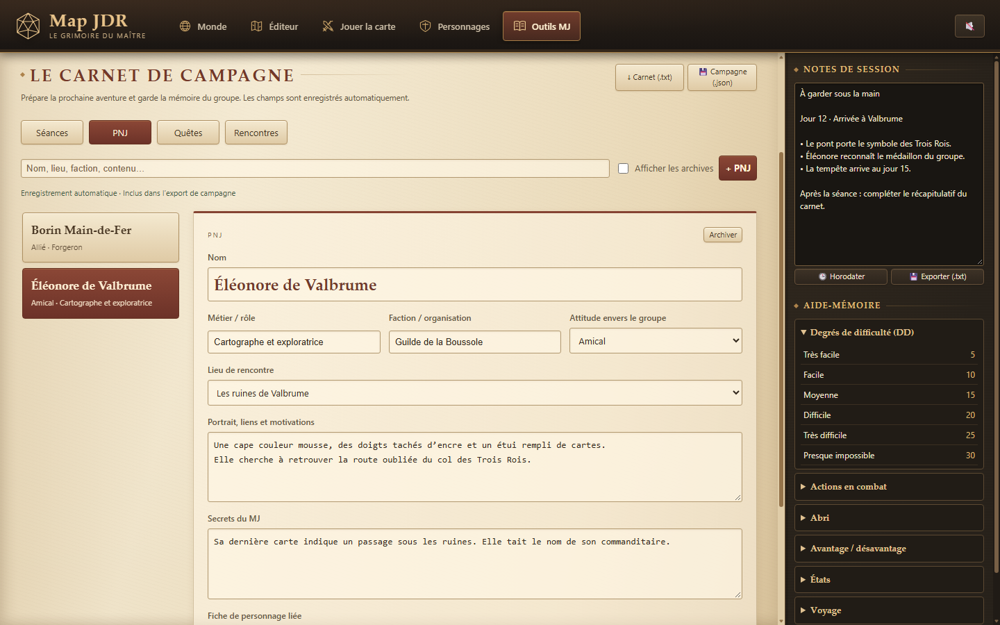 | 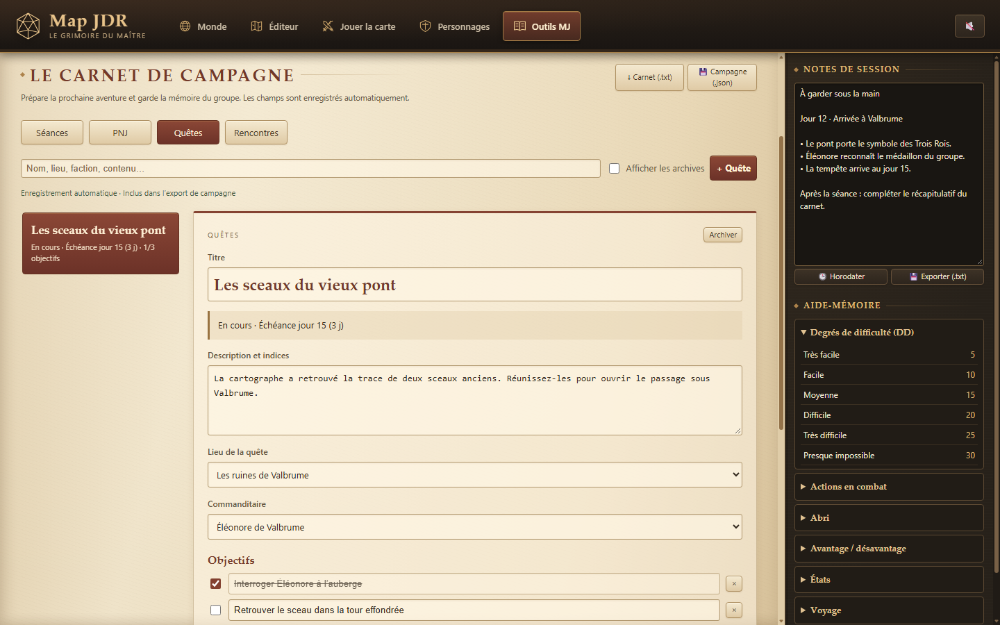 |

Coche tous les objectifs puis clique **Réussie · attribuer les récompenses**. L'or est partagé entre les personnages
vivants du groupe et le reste va au coffre commun ; sans groupe, tout l'or va au coffre. Chaque bénéficiaire reçoit
la quantité d'XP indiquée. Le reçu conserve le jour et le bilan de la clôture. Une quête clôturée ne redistribue
jamais sa récompense, et annuler un geste sur la battlemap conserve ces gains. Les objets, titres et faveurs de la
récompense narrative sont attribués manuellement par le MJ.

**Carnet (.txt)** exporte les séances, PNJ, quêtes et rencontres préparées, archives comprises. **Campagne (.json)** sauvegarde aussi le
monde, les fiches, l'équipement, les notes libres et l'historique des générateurs. Le carnet contient les secrets du MJ.

### ⚔ Bibliothèque de rencontres et renforts

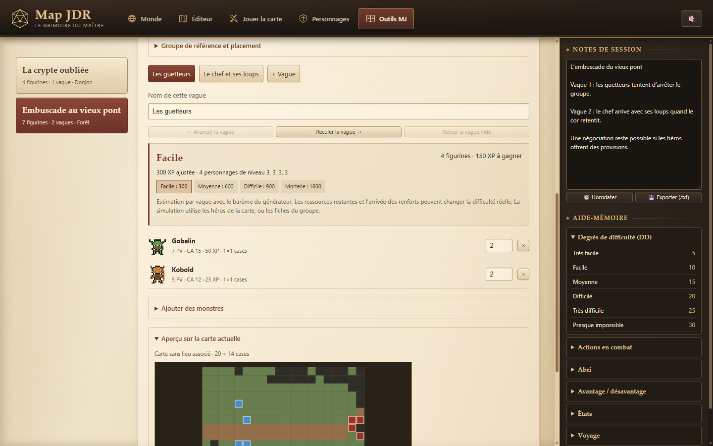

Dans **Carnet de campagne → Rencontres**, prépare tes combats à l'avance, ou conserve une rencontre aléatoire
avec **Enregistrer la rencontre** dans le générateur.

- **Composition modifiable** : recherche et filtre de taille dans les 21 monstres du bestiaire, quantités,
  statistiques et empreintes sur la carte. Jusqu'à **30 figurines réparties dans 4 vagues**, nommables et réordonnables.
- **Difficulté par vague** : XP brutes et ajustées, seuils facile à mortel, calculés à partir des niveaux de chaque
  fiche vivante du groupe. Un **groupe théorique** permet de préparer une rencontre pour 1 à 10 personnages de niveau 1 à 20.
  L'estimation utilise le barème du générateur ; l'équipement, le terrain et les ressources restantes changent le résultat réel.
- **Contexte de campagne** : titre, ambiance, tactiques, lieu et séance associés. La rencontre se retrouve aussi
  dans les panneaux du lieu et de la séance. Recherche, duplication et archivage fonctionnent comme dans le reste du carnet.
- **Aperçu du placement** : choix du bord d'arrivée ou du côté opposé aux héros. Les grandes figurines sont placées
  en premier, sur une surface de même hauteur, sans chevauchement, obstacle infranchissable, eau, lave ou vide.
  Le placement automatique utilise des cases au sol, y compris pour les créatures volantes ou aquatiques.
- **Pose complète ou refus** : si toute la vague ne tient pas, aucune figurine n'est ajoutée. La pose conserve les décors
  et les figurines présentes, peut cacher les nouveaux monstres aux joueurs et s'annule en un seul **Ctrl+Z**.
- **Simulation de la vague sélectionnée** : utilise les héros présents sur la carte, ou les fiches vivantes du groupe
  si aucun héros n'y figure. Les autres monstres sont retirés de la copie de simulation. La carte et les ressources réelles
  restent intactes ; chaque vague est testée séparément.

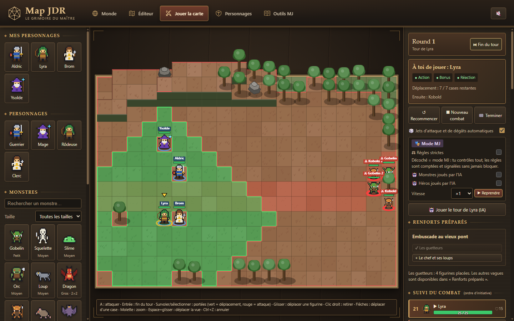

La première pose enregistre une copie des vagues dans la carte. Dans **Jouer → Renforts préparés**, déclenche les suivantes
au moment voulu : les monstres lancent leur initiative et rejoignent le combat sans changer le personnage actif.
Une vague déjà posée ne peut pas être ajoutée deux fois. Les vagues déclenchées, les figurines et l'ordre d'initiative
sont conservés dans la sauvegarde de carte et l'export de campagne.

Modifier le modèle du carnet ne change pas les renforts déjà préparés sur une carte. **Dupliquer** permet d'y utiliser
une nouvelle version. **Retirer toutes les figurines** retire aussi les plans de renforts de cette carte ; **Recommencer**
le combat conserve les figurines de toutes les vagues déjà déclenchées.

---

## 🔊 Sons

Effets synthétisés par le navigateur (aucun fichier audio) : coups, critiques, ratés, sorts, soins, flèches,
bénédiction, dés, début de tour, KO, mort, victoire, montée de niveau. Ils sont aussi joués sur l'écran des joueurs.
Bouton **🔊** en haut à droite pour les couper. Le navigateur n'active le son qu'après un premier clic dans la page.

---

## 📄 Le fichier de caractéristiques

`data/caracteristiques.txt` est un fichier texte commenté qui contient les **règles de déplacement** et les
**statistiques des figurines de base**. Le nom entre crochets est celui affiché dans l'appli.

```ini
[regles]
deplacement_diagonal = non   # non : une diagonale coûte 2 cases
attaque_diagonale    = oui   # une case en diagonale est à 1 case de portée
cout_montee          = 1     # +1 case par niveau monté
cout_descente        = 1     # +1 case par niveau descendu
bonus_portee_hauteur = 1     # +1 case de portée à distance par niveau au-dessus de la cible
melee_hauteur_max    = 1     # corps à corps impossible au-delà de cet écart de hauteur
ligne_de_vue         = oui   # tirs bloqués par murs, maisons, arbres, colonnes
# (règles strictes : case à cocher dans l'onglet Jouer)

[terrain]
boue = 2        # coût en cases ; sol non listé = 1
eau  = 2        # seulement pour les nageurs
lave = x        # x = infranchissable
mur  = x        # éléments aussi : arbre, mur, maison, colonne...

[Rôdeuse]
deplacement = 6
attaque     = 8      # portée en cases (1 = corps à corps)
saut        = 2      # niveaux d'escalade
vol         = non
nage        = oui
pv          = 24
ca          = 15
toucher     = +6
degats      = 1d8+3
init        = +3
xp          = 0      # XP gagnée par le groupe quand la figurine est vaincue
```

| Clé | Rôle |
| --- | --- |
| `deplacement` | Cases par tour |
| `attaque` | Portée d'attaque en cases (1 = corps à corps) |
| `saut` | Niveaux qu'on peut escalader d'une case à l'autre |
| `vol` / `nage` | `oui` / `non` |
| `pv`, `ca`, `toucher`, `degats`, `init` | Statistiques de combat |
| `xp` | Expérience rapportée par un monstre vaincu |
| `niveau` | Niveau (débloque des capacités ; 3 pour les héros de base) |
| `carac` | Les 6 caractéristiques : FOR DEX CON INT SAG CHA (ex. `12 15 12 3 12 6`) |
| `sauvegardes`, `maitrise` | Sauvegardes maîtrisées (ex. `dex con`) et bonus de maîtrise |
| `type_degats` | tranchant, perforant, contondant, feu, froid, acide, poison, foudre, force, necrotique, radiant |
| `resistances`, `immunites`, `vulnerabilites` | Types de dégâts divisés par 2, annulés, doublés |
| `multiattaque` | Attaques par action |
| `traits` | `meute`, `renversement`, `fuite_agile`, `agressif`, `sans_peur` |

**Charger le fichier modifié** :

- appli ouverte en **double-cliquant** : le navigateur interdit de lire un fichier tout seul ; onglet **Jouer** →
  **📄 Charger un .txt** (les valeurs sont mémorisées ; **↺ Défaut** pour revenir aux valeurs d'origine) ;
- appli servie par un **serveur local** : le fichier est lu automatiquement au démarrage.

Les fiches de l'onglet Personnages ont leurs propres valeurs, et les champs **Dépl.** et **Portée** du panneau
modifient une seule figurine.

---

## 💾 Sauvegardes et fichiers

Tout est enregistré **automatiquement dans le navigateur** (stockage local). Pour garder une copie ou changer d'ordinateur :

| Fichier | Contenu | Où |
| --- | --- | --- |
| **Campagne** `.json` | Monde, lieux, quêtes, cartes, fiches, équipement et coffre, caractéristiques, carnet, notes et historique du MJ | 🌍 Monde → 💾 Exporter / 📂 Importer ; export aussi depuis le carnet |
| Carte `.json` | Une carte de combat (avec figurines, brouillard, marqueurs et vagues de renforts) | 🛠 Éditeur → Sauvegarder / Charger |
| Carte `.png` | Image de la carte | 🛠 Éditeur → Exporter PNG |
| Personnages `.json` | Toutes les fiches | 🧙 Personnages → Exporter / Importer |
| Journal `.txt` | Journal de combat | 🎲 Jouer → Exporter |
| Notes `.txt` | Notes de session | 📜 Outils MJ → Exporter |
| Carnet `.txt` | Séances, PNJ, quêtes, rencontres et archives (lecture seule) | 📜 Outils MJ → Carnet → Carnet (.txt) |
| Caractéristiques `.txt` | Règles et figurines de base | `data/caracteristiques.txt` |

> ⚠️ Le stockage du navigateur est limité (environ 5 Mo) : exporte la campagne régulièrement.
> Une alerte prévient s'il est plein.

Les campagnes exportées utilisent le **format v4**. Les anciens fichiers restent importables : s'ils n'ont pas de
carnet, celui-ci démarre vide, sans reprendre les notes de la campagne précédente. L'import remplace la campagne et
réinitialise l'historique d'annulation de la battlemap.

---

## ⌨️ Raccourcis

**Éditeur et Jouer** : molette = zoom · glisser avec le clic molette (ou **Espace** + glisser) = déplacer la vue · **Ctrl+Z** = annuler · **Ctrl+Maj+Z** ou **Ctrl+Y** = rétablir.

**Outils de l'éditeur** : **V** = sélection · **B** = pinceau · **G** = remplissage · **U** = rectangle · **E** = gomme · **I** au survol d'une case = prélever son sol.

| 🛠 Éditeur | | 🎲 Jouer | |
| --- | --- | --- | --- |
| Clic gauche | Poser / peindre | Glisser | Déplacer une figurine |
| Clic droit | Supprimer | Clic droit | Retirer une figurine |
| **R** | Pivoter l'élément | **A** | Attaquer |
| **Ctrl+D** | Dupliquer | **Entrée** / **N** | Fin du tour |
| **Suppr** | Effacer l'élément | **Suppr** | Retirer la figurine |
| Flèches | Déplacer d'une case | Flèches | Déplacer d'une case |
| **Échap** | Annuler le rectangle en cours, sinon revenir à la sélection | **Échap** | Annuler le ciblage ou l'outil en cours |

| 🌍 Monde | | 📺 Écran des joueurs | |
| --- | --- | --- | --- |
| Clic | Sélectionner | Glisser | Déplacer la vue |
| **Maj+clic** | Ajouter au groupe | Molette | Zoom |
| Clic droit | Voyager | **F** | Recentrer |
| **Suppr** | Supprimer le lieu sélectionné | | |
| **Échap** | Désélectionner | | |

---

## ❓ Questions fréquentes

<details>
<summary><b>J'ai modifié <code>data/caracteristiques.txt</code> mais rien ne change.</b></summary>

En ouvrant `index.html` par double-clic, le navigateur interdit de lire le fichier. Utilise **📄 Charger un .txt**
(onglet Jouer), ou ouvre l'appli via un serveur local (Live Server, `python -m http.server`).
</details>

<details>
<summary><b>L'écran des joueurs ne s'ouvre pas.</b></summary>

Le navigateur a bloqué la fenêtre : autorise les pop-ups pour cette page (icône dans la barre d'adresse).
</details>

<details>
<summary><b>L'écran des joueurs ne se met pas à jour.</b></summary>

Il se synchronise par le stockage du navigateur. Ouvre les deux fenêtres dans le **même navigateur** ; si besoin,
sers l'appli avec un serveur local, ce qui rend la synchronisation plus fiable.
</details>

<details>
<summary><b>Je n'entends aucun son.</b></summary>

Vérifie le bouton **🔊** en haut à droite, et clique une fois dans la page : le navigateur n'active le son qu'après
une interaction. Sur l'écran des joueurs, clique aussi une fois dans la fenêtre.
</details>

<details>
<summary><b>Comment changer de monde sans perdre mes personnages ?</b></summary>

**🎲 Nouveau monde** (onglet Monde) remplace les lieux et le journal de voyage mais **garde les fiches**.
Exporte la campagne avant si tu veux pouvoir revenir à l'ancien monde.
</details>

<details>
<summary><b>Une figurine posée ne reflète pas les changements de sa fiche.</b></summary>

Une figurine garde une copie des valeurs de sa fiche. Clique **↻ Mettre à jour les figurines sur la carte** dans la fiche.
</details>

<details>
<summary><b>Le MJ garde-t-il le contrôle avec les règles strictes et l'IA ?</b></summary>

Oui. Par défaut tout est en **mode MJ** : rien n'est bloqué, les règles sont seulement comptées. Les règles strictes et
l'IA s'activent par des cases à cocher, et chaque figurine peut être reprise en main (**Contrôle : 🎭 MJ**).
Tu peux mettre l'IA en pause à tout moment, modifier les PV et les états, et annuler avec **Ctrl+Z**.
</details>

<details>
<summary><b>Pourquoi la simulation ne donne-t-elle pas la difficulté annoncée par le générateur ?</b></summary>

Le générateur utilise les seuils d'XP du Guide du maître, une estimation générale. La simulation joue réellement le
combat sur ta carte, avec le relief, les obstacles, les capacités de chacun et l'IA : elle mesure la difficulté pour
**ce** groupe, **ici**. L'IA joue correctement mais pas parfaitement ; de vrais joueurs peuvent faire mieux (ou pire).
</details>

<details>
<summary><b>Le jeu suit-il exactement les règles de D&D ?</b></summary>

Il s'en inspire fortement (caractéristiques, classes, avantage, jets contre la mort, table d'XP...) avec des simplifications
pour rester rapide à jouer : une sélection de capacités par classe, un seul emplacement de sort par capacité,
pas d'obscurité ni de vision dans le noir, une ligne de vue calculée case par case, un abri simplifié (+2).
Tout reste modifiable à la main par le MJ.
</details>

---

## 🧩 Pour aller plus loin (code)

L'appli est en **HTML / CSS / JavaScript sans dépendance**, en scripts classiques (pas de modules) pour fonctionner
en double-cliquant le fichier. Les scripts sont chargés dans cet ordre par `index.html` :

```text
index.html                 Page, onglets et panneaux
css/style.css              Structure et composants de l'interface
css/grimoire.css           Thème fantasy : cuir, parchemin, typographie, navigation et petits écrans
css/equipment.css          Inventaire, emplacements et navigation de l’atlas
css/notebook.css           Carnet du MJ, séances, répertoire et quêtes
css/encounters.css         Composition, estimation, aperçu et renforts
css/expedition.css         Camp, provisions et repos du groupe
data/caracteristiques.txt  Règles de déplacement et statistiques des figurines de base
docs/images/               Images de ce README
docs/visite-guidee.*       Visite guidée (GIF en tête du README, vidéo MP4)
scripts/                  Capture des médias du README dans un navigateur isolé

js/config.js     Sols (FLOORS) et éléments (OBJECTS)
js/utils.js      Couleurs, bruit, aléatoire
js/state.js      État global (carte, caméra, mode, outil, sélection), format des cartes
js/terrain.js    Relief : niveaux des cases, hauteur des éléments et des figurines
js/sprites.js    Personnages et monstres en pixel art (16×16)
js/stats.js      Lecture du fichier de caractéristiques (copie intégrée)
js/ranges.js     Zones de déplacement et d'attaque, ligne de vue
js/anims.js      Animations d'attaque et de zone, chiffres qui s'envolent
js/rules.js      Règles : caractéristiques, races, classes, états, dés, table d'XP
js/engine.js     Moteur de règles : mode MJ / règles strictes, hasard à graine, économie d'actions, sauvegardes,
                 types de dégâts, abri, durée des états, concentration, attaques d'opportunité
js/render.js     Rendu de la carte en 2D semi-3D
js/editor.js     Ajout / suppression, pinceau, annulation
js/mapmodules.js Salles, chemins, rivières et dispersion de décors avec aperçu et annulation
js/presets.js    Presets de carte générés
js/play.js       Onglet Jouer : figurines, rendu, souris, panneau de la figurine
js/combat.js     Initiative, PV, attaques, états, jets contre la mort, journal, dés
js/chars.js      Onglet Personnages : fiches et progression
js/fog.js        Brouillard de guerre, marqueurs secrets, écran des joueurs
js/sfx.js        Effets sonores synthétisés
js/actions.js    Capacités et sorts, actions standard, ciblage
js/items.js      Objets, inventaire, marché
js/equipment.js  Catalogue, équipement, effets en combat et transactions
js/skills.js     Compétences, perception passive, pièges et secrets automatiques
js/ai.js         IA des héros et des monstres (rôles, traits, moral), mode spectateur
js/sim.js        Simulateur de combat et rapport
js/gmtools.js    Onglet Outils MJ : générateurs, notes, aide-mémoire
js/worldgen.js   Génération du monde : relief, rivières, climat, biomes, royaumes, lieux
js/world.js      Onglet Monde : affichage, voyages, lieux, cartes liées, campagne
js/campaign.js   Événements de voyage, vivres, quêtes, réputation, marché, repos
js/equipment-ui.js Fiches d’équipement, objets personnalisés, coffre et commerce
js/world-atlas.js Mini-carte, itinéraires, favoris et navigation du monde
js/encounters.js  Bibliothèque de rencontres, vagues, budget d'XP et placement
js/notebook.js    Carnet de campagne, PNJ, séances, objectifs et sauvegardes du MJ
js/expedition.js Camp du groupe, distribution des rations, allures et repos sélectionnés
js/input.js      Souris et clavier (éditeur)
js/ui.js         Panneaux, palettes, réglages de carte
js/io.js         Sauvegarde, chargement, export PNG
js/main.js       Démarrage
```

| Ajouter... | Où |
| --- | --- |
| Un sol | `FLOORS` (`js/config.js`) |
| Un élément | `OBJECTS` (`js/config.js`) et, si nouvelle forme, un `case` dans `drawObj` (`js/render.js`) |
| Une figurine | `SPRITES` (`js/sprites.js`, dessin 16×16, une lettre par couleur), sa section dans `data/caracteristiques.txt`, son animation dans `ATTACKS` (`js/anims.js`) |
| Une race / une classe | `RACES` / `CLASSES` (`js/rules.js`) ; capacités de la classe dans `CLASS_ACTIONS` (`js/actions.js`) |
| Une capacité / un sort | `ACTIONS` (`js/actions.js`) : coût, récupération, niveau requis, type de dégâts |
| Un consommable | `ITEMS` (`js/items.js`) et son poids dans `ITEM_WEIGHT` (`js/equipment.js`) |
| Un équipement | `GEAR` (`js/equipment.js`) ; ses effets et emplacements sont décrits dans la même définition |
| Une compétence | `SKILLS` et `CLASS_SKILLS` (`js/skills.js`) |
| Un trait de monstre | clé `traits` dans `data/caracteristiques.txt`, effet dans `attack` / `attackMods` (`js/combat.js`) et l'IA (`js/ai.js`) |
| Un rôle d'IA | `ROLES` et `bestAttackSpot` (`js/ai.js`) |
| Un état | `CONDITIONS` (`js/rules.js`) ; son effet dans `attackMods` (`js/combat.js`) |
| Un preset | `PRESETS` (`js/presets.js`) avec une fonction `gen(g, deco)` |
| Un type de lieu | `LOC_TYPES` (`js/worldgen.js`) et son preset de combat dans `LOC_PRESET` (`js/world.js`) |
| Un biome | `BIOMES` (`js/worldgen.js`) avec sa couleur et son coût de voyage |
| Un générateur du MJ | `js/gmtools.js` (carte dans `buildGmTab`) |
| Une règle de déplacement | Section `[regles]` de `data/caracteristiques.txt`, lue dans `js/ranges.js` |

### Régénérer les captures et la vidéo

Sous Windows, avec **Microsoft Edge**, **Python + Pillow**, **FFmpeg** et **FFprobe** dans le PATH :

```powershell
py scripts/generate_readme_media.py
```

Le script capture l’application dans un profil temporaire, avec une partie de démonstration indépendante des sauvegardes personnelles.
Il recrée les PNG, les quatre GIF d’attaques et la visite guidée en MP4 et GIF. Les scènes sont définies dans `scripts/readme-scenes.js`.
Les images intermédiaires restent dans `.tmp/readme-media` pour vérification ; `--only modules` refait une scène et `--skip-capture` relance seulement l’encodage.

`py scripts/check_bestiary.py` vérifie aussi les monstres, les empreintes sur la carte, les filtres,
les anciens fichiers de caractéristiques et 75 combats simulés dans un profil isolé.
`py scripts/check_equipment.py` vérifie l’équipement, les ressources, les échanges, les objets magiques et l’atlas.
`py scripts/check_notebook.py` vérifie les séances, les PNJ, les objectifs, l'attribution unique des récompenses,
les exports/imports de campagne v3/v4, le rechargement et l'affichage à 1440, 1024 et 760 pixels.
`py scripts/check_encounters.py` vérifie la composition des rencontres, les niveaux mixtes, le placement,
les renforts en combat, l'annulation, les sauvegardes et trois simulations isolées.
`py scripts/check_expedition.py` vérifie les provisions, les dés de vie, la synchronisation des PV, les allures,
la sauvegarde des voyages, le rechargement et l’affichage du camp jusqu’à 390 pixels.

---

<div align="center">

*Fait pour les maîtres du jeu qui veulent passer moins de temps à préparer et plus de temps à raconter.* 🐉

</div>
